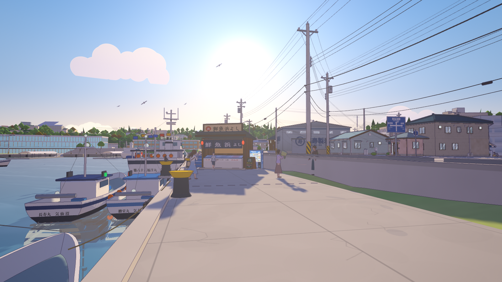
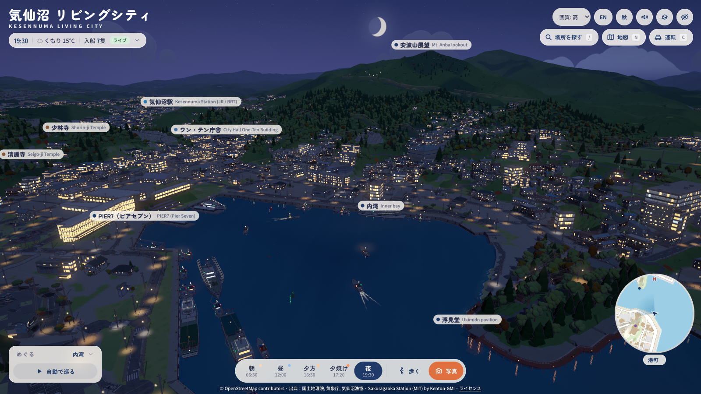
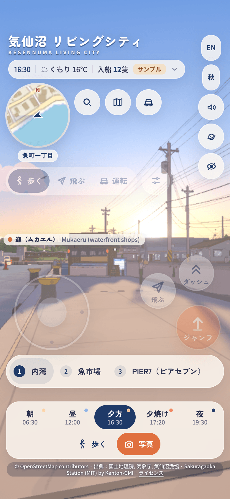

# KesenMemento v2: Kesennuma Living City

[日本語](README.ja.md)

**Walk, drive and fly through the real Kesennuma, a fishing city in Miyagi, Japan, drawn as an anime-style 3D world in
your browser and built from open data.** KesenMemento v2 is the sequel to KesenMemento, the KesenMemento team's
Hackatsuon 2025 project, which won the Mayor's Award and the People's Choice award. (The app itself is called Kesennuma
Living City.)

**Live demo: <https://kesennuma-living-city-production.up.railway.app/>** (add `?ship=1` to board the tuna longliner
第一昭福丸, see [The ship](#the-ship)). The first load builds the city in your browser and takes a while; the station-name
board shows the progress.


| | |
|---|---|
|  |  |
|  |  |

On a phone the town plays like a game, with a floating thumbstick and an arc of action buttons:



## Features

- **The real city, measured.** Terrain, coastline, roads and some 50,800 building footprints come from 国土地理院 (GSI)
  open data. OpenStreetMap adds building levels, roof shapes, names, land use, rivers, signals and road names. The GSI
  aerial photo gives each roof its colour, shape and ridge direction. Every value records its source, and an automated
  audit compares the rendered town with the aerial photo (see [Accuracy](#accuracy)).
- **A hand-painted look.** The cel-shaded engine is ported from
  [Sakuragaoka Station](https://github.com/Kenton-GMI/sakuragaoka-station) (MIT) by Kenton-GMI: colour-aware outlines,
  blue-violet shadows, painted clouds, bloom and grading.
- **Walk, drive, fly.** The whole core, about 4.3 × 4.4 km from 気仙沼駅 to the bay and from 鹿折 to 南気仙沼, streams in
  100 m tiles around you, with full detail (shop fronts, 電柱 and wires, bikes, vending machines) within about 100 m.
  Buildings, quay edges and river channels are walls. You can drive a kei car on the real road network or fly freely.
- **Search and maps.** Place search covers about 3,500 real names in Japanese and English. There are POI labels, a
  minimap and a full map, and 51 places that each have a drone framing and a walk spot on the nearest street.
- **Landmarks at true size.** Each is modelled from a reference sheet in [docs/anime/landmarks/](docs/anime/landmarks/):
  the fish market (all four halls and 海の市), かなえ大橋 and 大島大橋, 神明崎 with 浮見堂 and 五十鈴神社, the 魚町
  seawall with its flap gates, PIER7 and 迎, 安波山, the city hall, 気仙沼駅, リアス・アーク美術館, the hospitals, eight
  school grounds, shrines, temples and a church, the 風待ち heritage shops, and 大島's 亀山 monorail and 浦の浜 terminal.
- **Survey-grade rebuilds.** The PIER7 plaza on the south shore and the fish market's C hall roof deck and quay hall were
  rebuilt from on-site photos with structure from motion. Every named feature is checked against the survey: the mean 3D
  error of the built app is 0.046 m on the plaza (44 features) and 0.14 m at the fish market (59 features, median
  0.075 m). See [docs/anime/survey/](docs/anime/survey/).
- **Walk-in interiors.** The fish market C hall (the visitors' entrance, the 2F information hall and the gallery over
  the landing floor), 男山本店's shop on 魚町, and 気仙沼駅's waiting hall with its ticket gates and the day's departures.
- **The harbour, live.** Tuna longliners and saury boats lie in rows, and today's arrivals glide into the market under
  their real names. Weather comes from 気象庁 (JMA) and arrivals from the 気仙沼漁協 (the fishing co-op). If a live fetch
  fails, the app shows a saved sample and labels it **サンプル**; a copy older than an hour is labelled **キャッシュ**.
- **It changes.** Five times of day (lit for 10 October 2026), four seasons, rain and wet streets, traffic signals that
  cycle, and a harbour soundscape.
- **A phone tier.** A game-style touch pad (floating stick, drag to look, buttons that follow the mode) and a low tier
  that fits phone memory. See [docs/MOBILE-CONTROLS.md](docs/MOBILE-CONTROLS.md).
- **A true-scale tuna longliner.** 第一昭福丸 (owner 臼福本店) berths at the コの字岸壁 and can be boarded and played in
  three acts: the send-off, the longline set and haul, and the chain that brings the catch to Japan.
- **Tours and photos.** An auto tour, a tiny-planet view of the whole bay, a photo mode that saves a 3840×2160 PNG, a UI in
  Japanese and English.

## Quick start

You need [Bun](https://bun.sh) 1.3 or newer and a desktop browser with WebGL2 (Chrome or Safari on an Apple-silicon Mac
works best).

```sh
git clone https://github.com/ss251/kesenmemento-v2.git
cd kesenmemento-v2
bun install
bun run build                                   # bundles src/anime into dist/
bun run scripts/serve.js --port 8787 --no-build
# open http://127.0.0.1:8787/
```

```sh
bun test                                        # the unit tests
bun run scripts/live.js                         # print today's live state (JMA + the fishing co-op)
bun run scripts/live.js --fixtures              # the saved sample state
```

- `bun run serve` builds and then serves on port 8787 in one step.
- The server listens on 127.0.0.1 only. It serves `dist/` at `/`, `data/` at `/data/`, and `GET /api/live`, which returns
  today's weather, tide and arrivals.
- If your shell sets `NODE_OPTIONS` (for example for a debugger), prefix each command with `env -u NODE_OPTIONS`.
- The browser QA, the accuracy audit and the screenshot tools drive headless Chrome; see
  [docs/ARCHITECTURE.md](docs/ARCHITECTURE.md#tools).

## Controls

Click **まちへ出る · Enter the town** on the station-name board, or press Enter. The help line at the bottom of the screen
lists the keys.

| Key | Action |
|---|---|
| W A S D or arrows, mouse, Shift, Space | Walk, look around (click the scene to lock the pointer, Esc to release), run, jump |
| F | Fly on or off (E or Space climbs, Q or Ctrl descends; Shift is faster) |
| C | Get into a kei car on the nearest road, or out again (W / S, A / D, Space for the handbrake) |
| / | Search places in Japanese or English (a name such as 気仙沼駅, or a kind such as 病院 or "cafe") |
| N | The full map: drag to pan, wheel or pinch to zoom, click a place or street to go there |
| 1 – 9 | Go to the first nine places: 1 内湾, 2 魚市場, 3 PIER7, 4 浮見堂, 5 かなえ大橋, 6 大島大橋, 7 安波山, 8 気仙沼市役所, 9 ワン・テン庁舎 |
| G | Start or stop the auto tour through every place |
| V / R | Switch between the drone and walking / back to the inner-bay drone view |
| T / K | Next time of day / next season |
| O | Tiny planet on or off |
| P | Photo: saves a 3840×2160 PNG with no UI |
| H / M / \` | Hide the UI / sound on or off / frame counter |

**Interiors** need no key: walk in through the door. Search 魚市場 (or press 2) for the fish market C hall, 男山 for the sake
shop, or 気仙沼駅 for the station hall.

**On a phone** the touch pad has a floating thumbstick on the left (push past 85 % to run, or to boost in the car), a drag on
the right to look, and an arc of buttons at the bottom right that follows the mode. The chip at the top left switches
歩く / 飛ぶ / 運転. `?touch=1` shows the pad on a desktop and `?touch=0` turns it off. Details:
[docs/MOBILE-CONTROLS.md](docs/MOBILE-CONTROLS.md).

**URL options:** `?preset=asa|hiru|yugata|yuyake|yoru`, `?hours=17.1`, `?season=spring|summer|autumn|winter`,
`?weather=clear|cloudy|rain|live`, `?wet=0..1`, `?lang=ja|en`, `?q=high|medium|low`, `?fixtures=1` (force the sample data),
`?places=1` (open the places panel), `?stats`, `?cam=x,y,z>lx,ly,lz` (start from a given camera), `?stream=0` (no
street-level streaming), `?labels=0` (hide the boat labels), `?credit=1` (burn the credit line into stills), and
`?ship=1` (board the ship).

## Accuracy

Accuracy comes before invention: a Kesennuma resident should recognise their own street. The method has four parts.

1. **Real sources first, each value with its source.** Every lot stores where each of its values came from in `lot.src`.
   The precedence is OpenStreetMap, then the aerial photo, then the GSI facility annotation, then a value derived from the
   context. The sources are listed in `data/anime/sources.json` and [docs/DATA-SOURCES.md](docs/DATA-SOURCES.md).
2. **Reference sheets and surveys.** Each landmark has a sheet in `docs/anime/landmarks/` with its dimensions, colours and
   position, and the source of each. Two areas have a photo survey measured in metres
   ([docs/anime/survey/](docs/anime/survey/)). Web photos are used only as references for shape and colour and are never
   shipped.
3. **An automated audit.** `tools/anime/accuracy.mjs` renders the running app straight down with an orthographic camera
   over the core (24 tiles of 500 m at 0.5 m/px) and compares it with GSI footprints, the GSI z18 aerial photo, OpenStreetMap
   roads and the landmark sheets.
4. **Checks at street level.** `tools/anime/qa3.mjs` walks every place. Each walk spot must stand on land, outside every
   building, with the place in view. It also tests streaming, walking, driving, search, the map, the interiors and the labels.

Latest audit of the core (2026-10-01, after the per-cell corrections of v5):

| Metric | Target | Measured |
|---|---|---|
| Building coverage IoU against the GSI footprints | ≥ 0.80 | **0.839** (recall 0.928, precision 0.897) |
| Landmark position error | < 5 m | **15 of 15** under 5 m |
| Roof colour CIEDE2000 against the aerial photo, median | lower is better | 10.16 (8.52 with the photo's colour cast removed) |
| Building height against OSM and the landmark sheets, median absolute error | lower is better | 1.0 m |
| OSM roads against the rendered roads | higher is better | centre-line recall 0.786, IoU 0.499 |

The first audit (v4) scored 0.870 IoU and a median roof ΔE of 7.16. The scores against the GSI data went down on purpose in
v5: they treat the 2020-22 footprints and photo as truth, and the town now follows newer references where they differ (72
demolished buildings removed, 59 newer ones added, roofs that have been repainted). The buildings stand on the same GSI
footprints the IoU is measured against, so the IoU shows how faithfully the town is built on them, not whether GSI is right;
the roof colours, heights, landmarks and roads are checked against independent sources. The audit predates the 2026-10-03
survey rebuilds, which are checked against their own survey ([docs/anime/survey/](docs/anime/survey/)).

## Project layout

| Path | What is in it |
|---|---|
| `src/anime/` | The app: the engine (`core/`), the world modules (`world/`: environment, water, town, harbor, landmarks, life, ship, explore) and the UI (`ui/`) |
| `src/core/`, `src/server/` | Geo and sun maths shared by the app and the scripts; the `/api/live` endpoint |
| `src/web/` | Shared libraries and dev fixtures kept from the earlier viewer |
| `scripts/` | The data pipeline (GSI tiles to terrain, buildings and the layout; the OSM enrichment), the live-data fetchers, the bundler and the local server |
| `tools/` | QA and survey tools: headless-Chrome QA, the accuracy audit, screenshots, and the photo-survey (structure from motion) tools |
| `data/` | The built city data the app loads at run time (layout, terrain, aerial crops, i18n strings, the survey results) |
| `docs/` | Architecture, data sources, landmark reference sheets, the surveys and the ship guide |
| `test/` | The `bun test` suites |

Start with [docs/ARCHITECTURE.md](docs/ARCHITECTURE.md).

## Documentation

- [docs/ARCHITECTURE.md](docs/ARCHITECTURE.md): the engine, how the layout is derived from real data, the modules,
  streaming, the live layer and the tools.
- [docs/DATA-SOURCES.md](docs/DATA-SOURCES.md): every dataset, with its licence and attribution.
- [docs/PLAN.md](docs/PLAN.md): the roadmap.
- [docs/DEMO.md](docs/DEMO.md): a 3-minute walkthrough, with an offline fallback.
- [docs/MOBILE-CONTROLS.md](docs/MOBILE-CONTROLS.md): the touch pad.
- [docs/anime/](docs/anime/): the town package, per-cell overrides, the landmark reference sheets and the photo surveys.
- [docs/ship/](docs/ship/): 第一昭福丸, the model, the three acts and how to run them.
- [CONTRIBUTING.md](CONTRIBUTING.md), [SECURITY.md](SECURITY.md), [THIRD-PARTY-NOTICES.md](THIRD-PARTY-NOTICES.md).

## The ship

第一昭福丸 is a 58.6 m Atlantic-bluefin longliner. She lies at true scale at the コの字岸壁 in 魚浜町; open `?ship=1` (or
pick 「第一昭福丸に乗る」 in the places list) to board her. The guide is [docs/ship/SHOFUKUMARU.md](docs/ship/SHOFUKUMARU.md).

The 第一昭福丸 livery is 臼福本店's (design by nendo), used with permission in the live demo and not included in this
repository. Without it the app paints a plain livery.

## Known limits

- **Frame rate and load time.** The renderer is limited by draw calls (about 950 to 1,550 per frame on high, with 12 to
  14 M triangles). Measured on one Apple M2 Max with the browser throttled to background priority, a 1080p frame took
  20 to 32 ms on high and the first load took 45 to 55 s; a quieter run is faster, but 60 fps on high has not yet been
  measured on an idle machine. The low tier is faster.
- **4K.** Photo mode and the stills at 3840×2160 have only been tested at 1920×1080 or smaller.
- **Interiors.** Three buildings have interiors; every other building is solid.
- **Street detail.** Buildings beyond the 100 m kit radius are simplified. 唐桑 and the far parts of the city have terrain,
  footprints and roads but no street-level streaming.
- **Seasons.** The sun always follows the 10 October demo day, and spring blossom is painted onto broadleaf trees.
- **Tide.** `/api/live` reports the tide, but the rendered sea level does not follow it yet.
- **Driving.** There is one car and no other traffic.

## Data sources and attribution

- **Maps, terrain, aerial photos, buildings and roads:** 出典：国土地理院（地理院タイル）を加工して作成.
- **Names, land use, rivers and road attributes:** © OpenStreetMap contributors (ODbL).
- **Weather and tide:** 出典：気象庁ホームページ.
- **Today's arrivals:** the 気仙沼漁業協同組合 (the Kesennuma fishing co-op)'s public 入船情報 pages.

The in-app credit line reads: © OpenStreetMap contributors · 出典：国土地理院, 気象庁, 気仙沼漁協 · Sakuragaoka Station (MIT)
by Kenton-GMI. Terms, full credit lines and the list of derived files are in [docs/DATA-SOURCES.md](docs/DATA-SOURCES.md).

## Credits

- **The KesenMemento team**, who built this during the Hackatsuon 2026 residency in Kesennuma (28 September to
  11 October 2026).
- **Engine and page design:** [Sakuragaoka Station](https://github.com/Kenton-GMI/sakuragaoka-station) by **Kenton-GMI**,
  MIT licence ([src/anime/LICENSE-sakuragaoka-station](src/anime/LICENSE-sakuragaoka-station)). Every ported file keeps its
  credit header.
- **Libraries:** [three.js](https://threejs.org), [Spark](https://sparkjs.dev) (`@sparkjsdev/spark`),
  [takram](https://github.com/takram-design-engineering/three-geospatial) (`@takram/three-atmosphere`,
  `@takram/three-clouds`, `@takram/three-geospatial`), [3d-tiles-renderer](https://github.com/NASA-AMMOS/3DTilesRendererJS),
  `@mapbox/vector-tile`, `pbf`, `earcut`, [postprocessing](https://github.com/pmndrs/postprocessing) and
  [sharp](https://sharp.pixelplumbing.com). Licences: [THIRD-PARTY-NOTICES.md](THIRD-PARTY-NOTICES.md).
- **Fonts:** Noto Sans JP, Noto Serif JP, Zen Maru Gothic, Yusei Magic and Yuji Syuku from Google Fonts, under the SIL Open
  Font License.
- **Hackatsuon 2026**, organised by the Hackatsuon executive committee (Kesennuma City, NPO Women's Eye, Centrum and
  others).

**Unofficial project.** Not affiliated with or endorsed by Kesennuma City, 臼福本店, nendo or any other organisation named.

## Licence

- **Code:** MIT, see [LICENSE](LICENSE). The ported engine keeps its own MIT notice in
  [src/anime/LICENSE-sakuragaoka-station](src/anime/LICENSE-sakuragaoka-station).
- **Documentation** (this README and `docs/`): [CC BY 4.0](https://creativecommons.org/licenses/by/4.0/).
- **Data:** see `data/LICENSE.md`.
