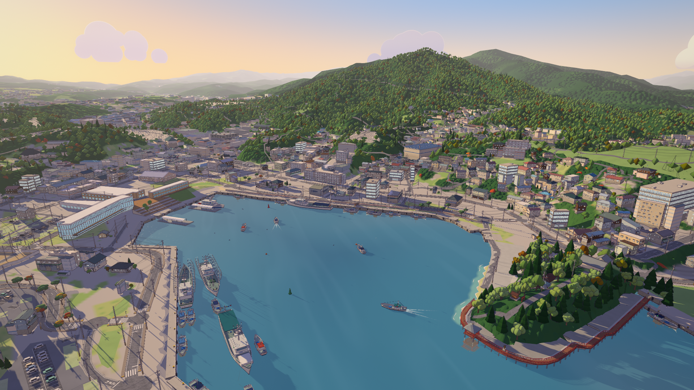
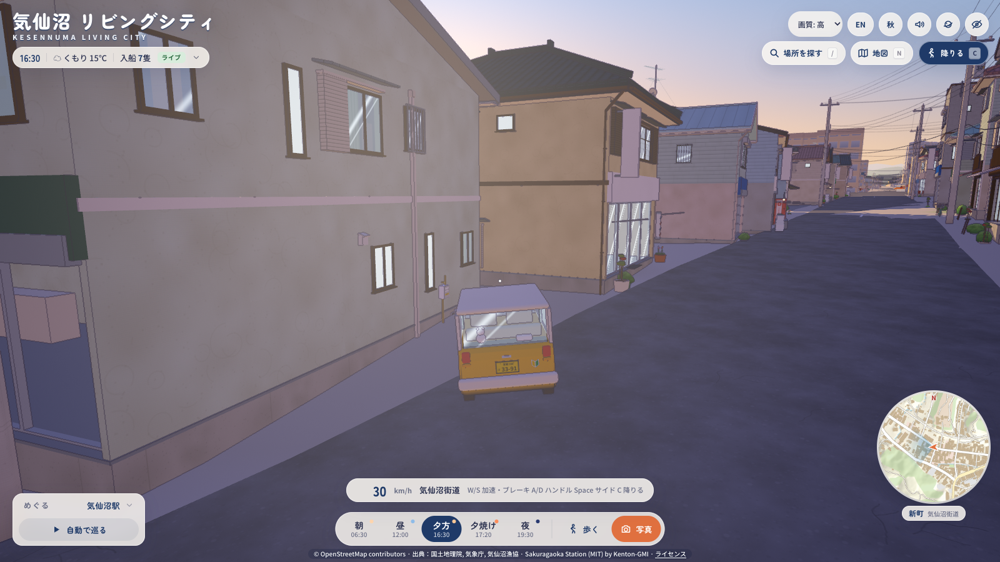
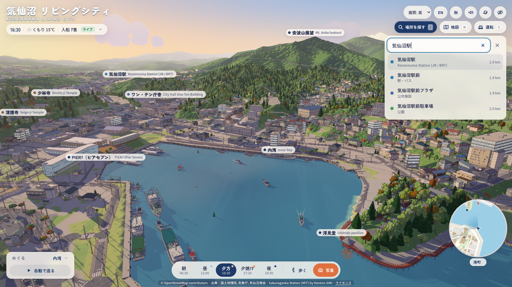
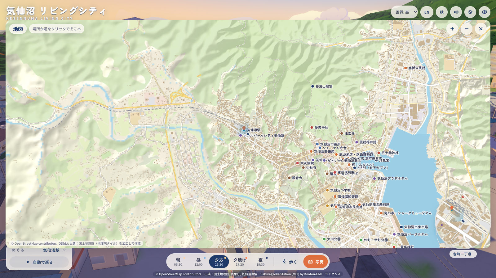
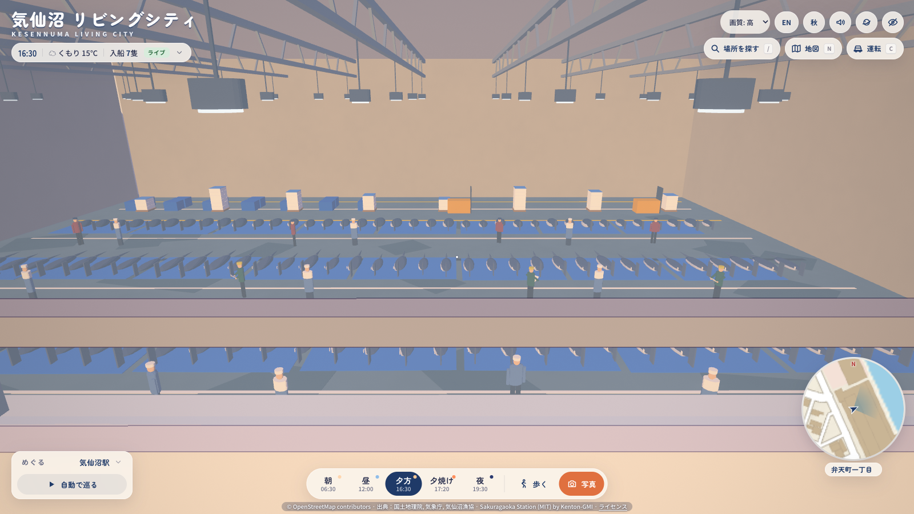
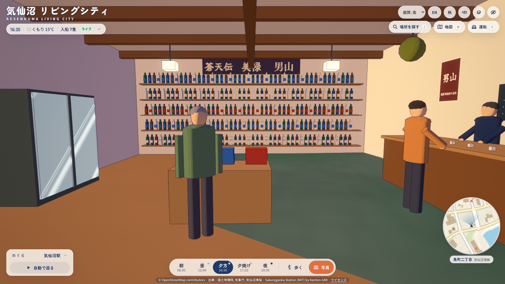
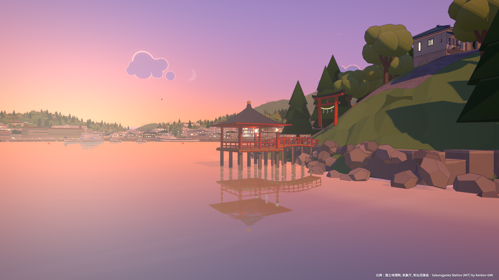

# Kesennuma Living City · 気仙沼 リビングシティ

[日本語](README.ja.md)

The real Kesennuma, drawn as a hand-painted anime town. You can fly over it, walk its streets, drive its roads, look
up any place by name and step inside the fish market, a sake shop and the station. Today's weather and today's boats
keep it alive.



| | |
|---|---|
|  |  |
|  |  |
|  |  |

## What it is

- **The real city, measured.** Terrain, coastline, roads and all 50,826 building footprints come from 国土地理院 (GSI)
  open data. OpenStreetMap adds building levels, roof shapes, names, land use, rivers, signals and road names. The GSI
  aerial photo gives each roof its colour, shape and ridge direction. Every value records its source, and an automated
  audit compares the rendered town with the aerial photo (see [Accuracy](#accuracy)).
- **Hand-painted look.** The cel-shaded engine is ported from
  [Sakuragaoka Station](https://github.com/Kenton-GMI/sakuragaoka-station) (MIT) by Kenton-GMI. It draws colour-aware
  outlines, blue-violet shadows, painted clouds, bloom and grading.
- **The whole core is explorable.** The street-level area covers the whole core, about 4.3 × 4.4 km: from 気仙沼駅 in
  the west across the inner bay, and from 鹿折 in the north to 南気仙沼 and the city hospital in the south. It streams
  in 100 m tiles around you: simplified buildings on their real footprints farther out, and full hero-kit detail (shop
  fronts, 電柱 and wires, bikes, vending machines) within about 100 m. You can walk everywhere, with buildings, quay edges and river channels as walls. You can drive a kei car on
  the real road network or fly freely.
- **Real names.** Public buildings and every shop that OpenStreetMap or GSI names carry their real name on their
  signs. Other shops get fictional but plausible names for their trade. Place search covers about 3,500 real names in
  Japanese and English, and POI labels float over the places near you.
- **Landmarks at their true size.** Each landmark is modelled from a reference sheet in
  [docs/anime/landmarks/](docs/anime/landmarks/), from official, engineering and tourism sources. They include the
  fish market (all four halls and 海の市), かなえ大橋 and 大島大橋, 神明崎 with 浮見堂 and 五十鈴神社, the 魚町 seawall
  with its flap gates, PIER7 and 迎, 安波山, the city hall, 気仙沼駅, リアス・アーク美術館, the hospitals, eight school
  grounds, shrines, temples and churches, the 風待ち heritage shops, and 大島's 亀山 monorail and 浦の浜 terminal.
- **Walk-in interiors.** You can walk into three buildings: the fish market C hall (the visitors' entrance, the 2F
  information hall and the gallery over the swordfish landing floor), 男山本店's shop on 魚町, and 気仙沼駅's waiting
  hall with its ticket gates and the day's departure board.
- **The harbour.** Tuna longliners and saury boats are moored in rows, and working boats line the quays. Today's
  arrivals glide into the market under their real names. The bay-cruise boat ファンタジー is moored at PIER7, and the
  aquaculture rafts (養殖筏) float only where the aerial photo shows them.
- **It changes.** There are five times of day (朝 06:30, 昼 12:00, 夕方 16:30, 夕焼け 17:20 and 夜 19:30), lit for
  Oct 10, 2026. There are four seasons (春, 夏, 秋 and 冬), rain and wet streets, traffic signals that cycle, and a
  harbour soundscape.
- **Live data.** The weather comes from 気象庁 (JMA) AMeDAS and the JMA forecast. Today's arrivals come from 気仙沼漁協
  (the Kesennuma Fisheries Co-op). If the live fetch fails, the app shows the saved sample and labels it
  **サンプル**. If the server can answer only from a cached copy that is over an hour old (or a port list from an
  earlier day), the chip says **キャッシュ** and gives the time of the copy.
- **Tours and photos.** The seven classic tour stops are joined by 44 more real places: 17 civic landmarks and 27
  places in town. Each place has a drone framing and a walk spot on the nearest street. There is also an auto tour, a
  tiny-planet view of the whole bay and a photo mode that saves a 3840×2160 PNG. The UI is in Japanese and English,
  and there is a phone layout.

## Run it

You need [Bun](https://bun.sh) 1.3 or newer and a desktop browser with WebGL2. Chrome or Safari on an Apple-silicon
Mac works best.

```sh
bun install
bun run build                                  # bundles src/anime into dist/ (under a second)
bun run scripts/serve.js --port 8787 --no-build
# open http://127.0.0.1:8787/
```

- `bun run serve` builds and then serves on port 8787 in one step.
- The server listens on 127.0.0.1 only. It serves `dist/` at `/`, `data/` at `/data/`, and `GET /api/live`, which
  returns today's weather, tide and arrivals.
- On first load the browser builds the city. The station-name board shows the progress. On the shared, throttled
  M2 Max this took 45 to 55 s.
- If your shell sets `NODE_OPTIONS` (for example for a debugger), prefix each command with `env -u NODE_OPTIONS`.

Other commands:

```sh
bun test                                       # 474 tests in 29 files (layout, enrichment, landmarks, explore, live, i18n)
bun run scripts/live.js                        # print today's live state (JMA + 気仙沼漁協)
bun run scripts/live.js --fixtures             # the saved sample state
bun tools/anime/check.mjs explore              # triangle and texture budget for one world module (no GPU)
bun run scripts/anime/build-explore.js         # rebuild data/anime/explore.json (deterministic, under a second)
```

The browser QA, the accuracy audit, the screenshots, the stills and the film drive headless Chrome with the real GPU.
See [docs/ARCHITECTURE.md](docs/ARCHITECTURE.md#tools).

## Controls

Click **まちへ出る · Enter the town** on the station-name board, or press Enter. The help line at the bottom of the
screen lists the keys.

**On foot (the default after 歩く or V)**

| Key | Action |
|---|---|
| W A S D or the arrow keys | Walk. Buildings, quay edges and river channels are walls. |
| Mouse | Look around. Click the scene to lock the pointer, and press Esc to release it. Without a lock, drag to look. |
| Shift | Run |
| Space | Jump |

**Flying**

| Key | Action |
|---|---|
| F | Fly on or off. In flight you pass through walls. |
| W A S D, mouse | Fly where you look, at 25 m/s (70 m/s with Shift) |
| E or Space / Q or Ctrl | Climb / descend |

**Driving**

| Key | Action |
|---|---|
| C (or the 運転 button) | Get into a kei car on the nearest road, or get out onto the pavement |
| W / S or ↑ / ↓ | Accelerate / brake, then reverse. Top speed is 40 km/h (60 km/h with Shift). |
| A / D or ← / → | Steer. When you let go, the car keeps to the left lane of the road it is on. |
| Space | Handbrake |
| Mouse | Orbit the chase camera. It swings back behind the car on its own. |

The car keeps to the carriageway, slides along the kerb, is stopped by buildings and the sea, and rides up and over
bridge decks. Its lamps come on at dusk. V, R, F or a number key gets you out of the car first.

**Finding your way**

| Key | Action |
|---|---|
| / (or ⌘F / Ctrl+F, or 場所を探す) | Search places in Japanese or English. A name (気仙沼駅, マンボ, "Otokoyama") or a kind of place (病院, 寿司, "hospital", "cafe") works, and kana are folded (マイヤ = まいや). Use ↑ ↓ and Enter, or click a result. With an empty box it lists the tour, the civic landmarks and the places in town. |
| N (or 地図, or click the minimap) | The full map. Drag to pan, and use the wheel, pinch or + / − to zoom. Click a place or a street to go there. |
| Esc | Close the search or the map |
| 1 – 9 | Go to the first nine stops of the places list: 1 内湾, 2 魚市場, 3 PIER7, 4 浮見堂, 5 かなえ大橋, 6 大島大橋, 7 安波山, 8 気仙沼市役所, 9 ワン・テン庁舎. From the drone this flies there; on foot it puts you on the stop's walk spot. |
| G | Start or stop the auto tour through every stop |
| V | Switch between the drone and walking. Walking starts at the current stop's walk spot. |
| R | Back to the inner-bay drone view |

When you go to a place from the search or the map, the app walks you there if you are on foot and flies you there
otherwise. The place's label stays pinned until you move about 300 m away.

**Time, views and output**

| Key | Action |
|---|---|
| T | Next time of day |
| K | Next season (秋 → 冬 → 春 → 夏) |
| O | Tiny planet on or off |
| P | Photo: saves a 3840×2160 PNG with no UI |
| H | Hide or show the UI |
| M | Sound on or off |
| \` | Frame counter (fps, draw calls, triangles) |

On a phone the town plays like a mobile game (`docs/MOBILE-CONTROLS.md`): a floating thumbstick on the left (past 85 % you run,
or boost in the car), a drag on the right to look, and an arc of buttons at the bottom right that follows the mode:
ジャンプ / ダッシュ / 飛ぶ / 乗る or 入る on foot, 上昇 / 下降 / 加速 / 歩く in flight, ブレーキ / ブースト / 降りる in the car.
The chip at the top left switches 歩く / 飛ぶ / 運転, and its settings button swaps the sides (left-handed), inverts the look and
sets the sensitivity. `?touch=1` shows the pad on a desktop, `?touch=0` turns it off.

**Interiors.** No key is needed: walk in through the door.

- **Fish market C hall.** Search 魚市場 or press 2. Walk to the glazed visitors' door in the land-side wall, then take
  the stair to the 2F gallery.
- **男山本店.** Search 男山. It is on the 魚町 waterfront road, and the shop door faces the street.
- **気仙沼駅.** Search 気仙沼駅. Walk through the arcade into the waiting hall.

**On screen**

- **Top left:** the live chip (clock, weather and 入船 N隻). Click it to see today's arrivals.
- **Top right:** quality (画質), JA/EN, season, sound, tiny planet and hide UI. Under them are 場所を探す (search), 地図
  (map) and 運転 (drive).
- **Bottom right:** the minimap, with north up. It shows your position, heading and view cone, and names the 町名 and
  the road you are on. In the car, a chip at the bottom centre shows your speed and the road name.
- **Bottom left:** the places panel (めぐる). Click it to list every stop, and click 自動で巡る for the auto tour.
- **Bottom centre:** the five time presets, 歩く/空から (walk or drone) and 写真 (photo).
- **Bottom edge:** the data credit, © OpenStreetMap contributors · 出典：国土地理院, 気象庁, 気仙沼漁協 · Sakuragaoka
  Station (MIT) by Kenton-GMI, with a link to the licences. The full map repeats the map-data credit.

On a phone, the minimap moves to the top left (the top centre in landscape) with the search, map and drive buttons beside
it, the touch pad takes the lower half of the screen, and at most 10 labels show at a time.

**URL options:** `?preset=asa|hiru|yugata|yuyake|yoru`, `?hours=17.1`, `?season=spring|summer|autumn|winter`,
`?weather=clear|cloudy|rain|live`, `?wet=0..1`, `?lang=ja|en`, `?q=high|medium|low`, `?fixtures=1` (force the sample
data), `?places=1` (open the places panel), `?stats`, `?cam=x,y,z>lx,ly,lz` (start from a given camera), `?stream=0`
(no street-level streaming; town builds the mid zone as in v3), `?labels=0` (hide the boat labels), `?credit=1` (burn
the credit line into stills).

## Accuracy

Accuracy comes before invention: a Kesennuma resident should recognise their own street. The method has four parts.

1. **Real sources first, each value with its source.** Every lot stores where each of its values came from in
   `lot.src`. The precedence is OpenStreetMap, then the aerial photo, then the GSI facility annotation, then a value
   derived from the context. The sources are listed in `data/anime/sources.json` and
   [docs/DATA-SOURCES.md](docs/DATA-SOURCES.md).
2. **Reference sheets for landmarks.** Each landmark has a sheet in `docs/anime/landmarks/` with its dimensions,
   colours and position, and the source of each. The builders read their measurements from one table
   (`src/anime/world/harbor/real.js`, `src/anime/world/landmarks/sites.js`). Web photos were used only as references
   for shape and colour and are never shipped.
3. **An automated audit.** `tools/anime/accuracy.mjs` renders the running app straight down with an orthographic
   camera over the core (24 tiles of 500 m at 0.5 m/px, a 1.1 km disc round the inner bay). It compares the render
   with GSI footprints, the GSI z18 aerial photo, OpenStreetMap highways and the landmark sheets, and saves a
   side-by-side of photo, render and difference for every tile.
4. **Checks at street level.** `tools/anime/qa3.mjs` walks every place. Each walk spot must stand on land, outside
   every building, with the place in view. It also tests the streaming, walking, driving, search, the map, the
   interiors and the labels (146 checks).

Latest audit (the core, 2026-09-30 20:18Z; `dist/qa4/accuracy_docs4.json`, written by `accuracy.mjs --tag docs4`):

| Metric | Target | Measured |
|---|---|---|
| Building coverage IoU against the GSI footprints | ≥ 0.80 | **0.870** (recall 0.940, precision 0.921) |
| Landmark position error | < 5 m | **15 of 15** under 5 m (largest 3.7 m, a かなえ大橋 pylon) |
| Roof colour CIEDE2000 against the aerial photo, median | lower is better | 7.16 (5.63 with the photo's colour cast removed); 67 % of roofs under 10 |
| Building height against OSM and the landmark sheets, median absolute error (75 buildings) | lower is better | 1.1 m |
| OSM road centre-lines covered by rendered roads | higher is better | 0.905 |
| Rendered asphalt against OSM carriageways (buffered by width) | higher is better | precision 0.576, recall 0.786 |

Two notes on reading these numbers. The buildings stand on the same GSI footprints the IoU is measured against, so the
IoU shows how faithfully the town is built on them (walls under the eaves, wings, landmarks replacing lots), not
whether GSI is right. The roof colours, the heights, the landmarks and the roads are checked against independent
sources. Road precision is lower for a known reason: the rendered asphalt covers about 1.36 times the area of the OSM
carriageways (369,000 against 271,000 m²). Where an OSM way has a `width` or `lanes` tag, the asphalt follows it and
the rest of the GSI road width is pavement. Outside the inner bay most streets have neither tag, so their asphalt spans
the whole measured GSI width, while the audit's truth uses OSM's default width for the road class.

## Status and known gaps

The numbers below were measured on an M2 Max. The machine was shared, so the browser ran at background priority
(`taskpolicy -b`, `nice 15`). A foreground browser on a quiet machine should be much faster.

- **Frame rate.** At 1920×1080 on high, under the machine gate, a frame took 20 to 32 ms: promenade 19.7, market
  23.9, drone 25.3, night 30.3 and whole city 32.0 (`dist/qa3/bench_report.json`, 2026-09-30). Low took 19 to 22 ms.
  The live app ran at 13 to 16 fps at 1600×900 on high over two runs, on the inner bay and while streaming the far
  core alike. A
  frame has about 950 to 1,550 draw calls and 12 to 14 M triangles, and the renderer is limited by draw calls. The v3
  build ran at 52 fps on the same Mac when it was quieter, so the 60 fps target on high still has to be measured on a
  quiet machine.
- **Load time.** Under the throttle, the page took 45 to 55 s to be ready. About 20 to 27 s of that is building the
  world; the town alone takes 10 to 15 s, mostly drawing Japanese text into textures. The target is 10 s.
- **4K.** The stills, the 30 s film and photo mode at the full 3840×2160 have only been tested at 1920×1080 or
  smaller.
- **Interiors.** Three buildings have interiors. Every other building is solid, although in the inner bay you can
  see into the shop rooms through the glass.
- **Street detail.** Outside the inner bay, parked cars are simple boxes, and buildings beyond the 100 m kit radius
  are simplified. 唐桑 and the far parts of the city have terrain, footprints and roads but no street-level
  streaming.
- **Seasons.** The sun always follows the Oct 10 demo day. Spring paints blossom onto broadleaf trees; there are no
  dedicated cherry-tree models.
- **Tide.** `/api/live` reports the tide, but the rendered sea level does not follow it yet.
- **Driving.** There is one car and no other traffic. The traffic signals cycle, but nothing on the road obeys them yet.

## Documentation

- [docs/PLAN.md](docs/PLAN.md): the living-city roadmap, from the Oct 10 demo onward, and what it needs from the city.
- [docs/ARCHITECTURE.md](docs/ARCHITECTURE.md): the engine, how the layout is derived from real data, the modules,
  streaming, and the tools.
- [docs/DATA-SOURCES.md](docs/DATA-SOURCES.md): every dataset, with its licence and attribution.
- [docs/DEMO.md](docs/DEMO.md): the 3-minute Oct 10 demo script, with an offline fallback.
- [docs/anime/BUILDER-GUIDE.md](docs/anime/BUILDER-GUIDE.md), [docs/anime/TOWN.md](docs/anime/TOWN.md) and
  [docs/anime/landmarks/](docs/anime/landmarks/): the engineering contract and the landmark reference sheets.

## Credits

- **Engine and page design:** [Sakuragaoka Station](https://github.com/Kenton-GMI/sakuragaoka-station) by
  **Kenton-GMI**, MIT licence. The licence text is in [src/anime/LICENSE-sakuragaoka-station](src/anime/LICENSE-sakuragaoka-station),
  and every ported file keeps its credit header.
- **Map data:** © [OpenStreetMap](https://www.openstreetmap.org/copyright) contributors, under the Open Database
  License (ODbL). This covers building levels, roof shapes, names, land use, rivers, road names, signals and rail.
- **Maps, terrain, aerial photos, buildings and roads:** 出典：国土地理院 (GSI tiles: 標高タイル, 全国最新写真（シームレス）
  and 最適化ベクトルタイル, including the 注記 place names). The data was processed to build this app.
- **Weather and tide:** 出典：気象庁 (AMeDAS 気仙沼, the Miyagi forecast, and the 大船渡 tide table).
- **Today's arrivals:** 気仙沼漁協 (気仙沼漁業協同組合) 入船情報.
- **Other libraries and fonts:** [three.js](https://threejs.org) (MIT). Fonts from Google Fonts under the SIL Open Font
  License: Noto Sans JP, Noto Serif JP, Zen Maru Gothic, Yusei Magic and Yuji Syuku.

The in-app credit line reads: © OpenStreetMap contributors · 出典：国土地理院, 気象庁, 気仙沼漁協 · Sakuragaoka
Station (MIT) by Kenton-GMI. It links to the licence texts, which the build copies to `dist/licenses/`. The full map
shows © OpenStreetMap contributors (ODbL); 出典：国土地理院（地理院タイル）を加工して作成.

Details and terms are in [docs/DATA-SOURCES.md](docs/DATA-SOURCES.md). The project's own code is MIT (`package.json`).
