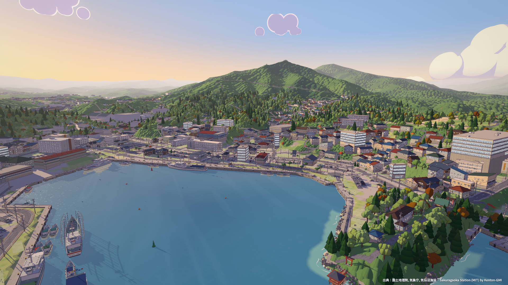
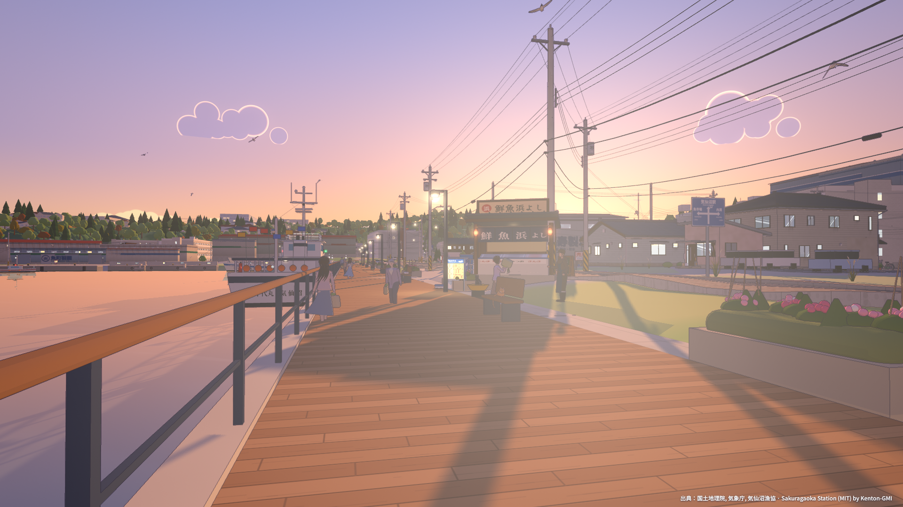
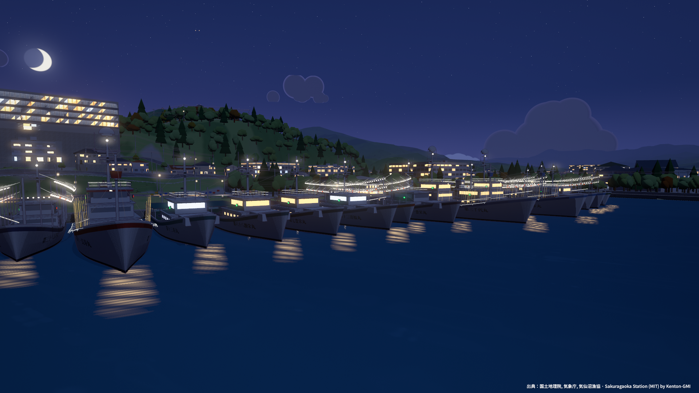
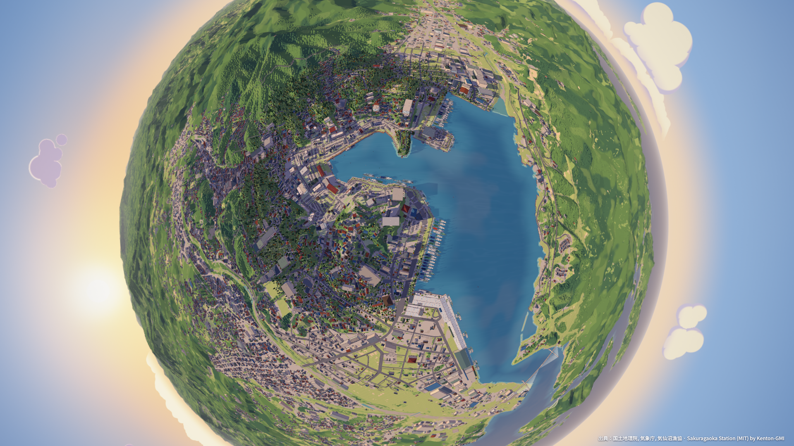
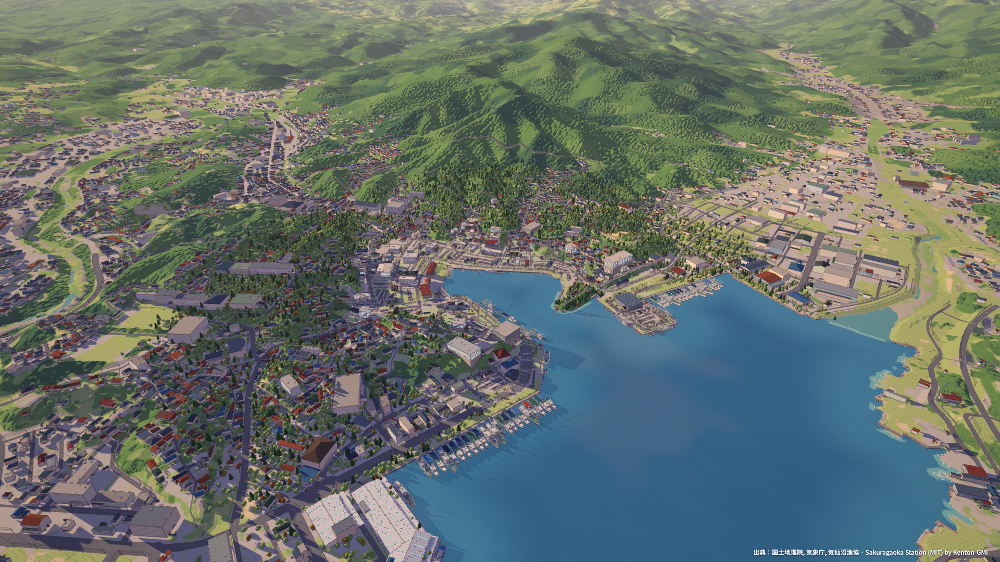
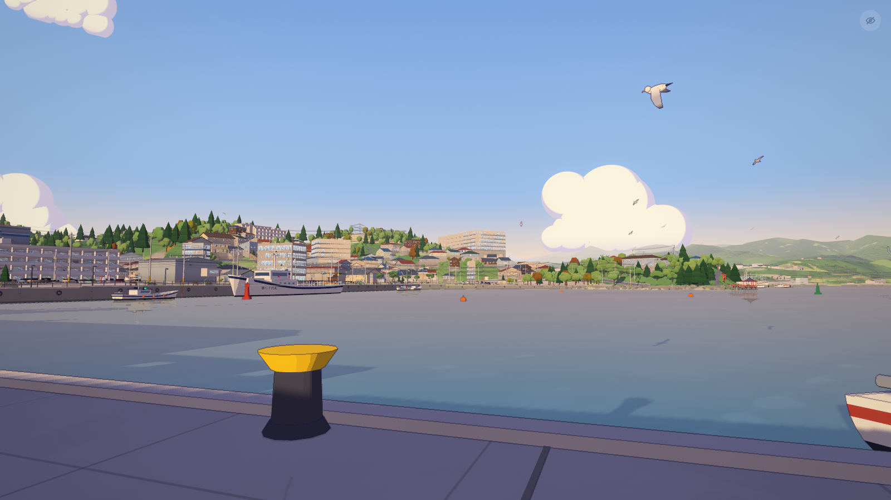

# Kesennuma Living City · 気仙沼 リビングシティ

[日本語](README.ja.md)

The real Kesennuma, rendered as a hand-painted anime town you can fly over and walk through, and kept alive with
today's weather and today's boats.



| | |
|---|---|
|  |  |
|  |  |
|  |  |

## What it is

- **The real city.** Terrain, coastline, roads and all 50,826 building footprints come from 国土地理院 (GSI) open data.
  Roof colours are sampled from the GSI aerial photo. Nothing is placed by an invented block generator.
- **Hand-painted look.** The cel-shaded engine is ported from
  [Sakuragaoka Station](https://github.com/Kenton-GMI/sakuragaoka-station) (MIT) by Kenton-GMI. It draws colour-aware
  outlines, blue-violet shadows, painted clouds, bloom and grading.
- **The inner bay (内湾) in full detail.** Within about 380 m of the inner bay you can walk everywhere: 八日町, 魚町,
  南町, 神明崎, Pier 7 (第7岸壁) and the seawall promenade. The shops have signs, 暖簾 and rooms you can see into, and
  there are vending machines, power poles with sagging wires, cats and townspeople. Every shop name is fictional.
- **The harbour.** Tuna longliners and saury boats are moored in rows, working boats line the market quay, the 内湾 quays
  and the 南町 quay, and today's arrivals stay berthed at the market for the rest of the day. Skipjack pole-and-line boats
  unload at the fish market (魚市場). You can also see 浮見堂, the 五十鈴神社 torii and shrine, the 安波山 lookout, かなえ大橋 (the Kanae
  Ohashi bridge), 大島大橋 (the Oshima Ohashi bridge) and the Oshima ferry.
- **It changes.** There are five times of day (朝 06:30, 昼 12:00, 夕方 16:30, 夕焼け 17:20 and 夜 19:30), each lit for
  Oct 10, 2026. There are four seasons (春, 夏, 秋 and 冬), rain and wet streets, and a harbour soundscape.
- **Live data.** The weather comes from 気象庁 (JMA) AMeDAS and the JMA forecast. Today's arrivals come from 気仙沼漁協
  (the Kesennuma Fisheries Co-op). Listed boats glide into the market under their real names. When the live fetch
  fails, the app shows the saved sample and labels it **サンプル**. When the server could only answer from its cache
  and that copy is over an hour old (or the port list is from an earlier day), the chip says **キャッシュ** and the time
  of the copy instead of ライブ.
- **Tours and photos.** There are seven tour stops with drone flights between them, and an auto tour. Every stop also
  has a walk spot at street level (歩く, or V). There is also a
  tiny-planet view of the whole bay and a photo mode that saves a 3840×2160 PNG. The UI is in Japanese and English,
  and there is a phone layout.

## Run it

You need [Bun](https://bun.sh) 1.3 or newer and a desktop browser with WebGL2. Chrome or Safari on an Apple-silicon
Mac works best.

```sh
bun install
bun run build                                  # bundles src/anime into dist/ (under a second)
bun run scripts/serve.js --port 8787 --no-build
# open http://127.0.0.1:8787/
```

- `bun run serve` builds and then serves on port 8787 in one step.
- The server listens on 127.0.0.1 only. It serves `dist/` at `/`, `data/` at `/data/`, and `GET /api/live`, which
  returns today's weather, tide and arrivals.
- On the first load the browser builds the whole city, which took about 15 to 20 s on the shared, throttled M2 Max.
  The station-name board shows the progress.
- If your shell sets `NODE_OPTIONS`, for example for a debugger, prefix each command with `env -u NODE_OPTIONS`.

Other commands:

```sh
bun test                                       # 259 tests (layout, modules, live parsers, i18n, determinism, walk spots)
bun run scripts/live.js                        # print today's live state (JMA + 気仙沼漁協)
bun run scripts/live.js --fixtures             # the saved sample state
bun tools/anime/check.mjs town                 # triangle and texture budget for one world module (no GPU)
```

The screenshot, QA, stills and film tools drive headless Chrome with the real GPU. See
[docs/ARCHITECTURE.md](docs/ARCHITECTURE.md#tools).

## Controls

Click **まちへ出る · Enter the town** on the station-name board, or press Enter.

| Key | Action |
|---|---|
| W A S D or the arrow keys | Walk. The quay edges are walls: you cannot walk into the sea. In flight, these fly the camera. |
| Mouse | Look around. Click the scene to lock the pointer and press Esc to release it. Without a lock, drag to look. |
| Shift | Run |
| Space | Jump. In flight, Space climbs. |
| E / Q | Fly up / down |
| F | Fly on or off (fly mode goes through walls) |
| 1 – 7 | Go to a tour stop: 1 内湾, 2 魚市場, 3 第7岸壁, 4 浮見堂, 5 かなえ大橋, 6 大島大橋, 7 安波山. From the drone this flies there; in walk view it drops you at the stop's walk spot. |
| G | Start or stop the auto tour |
| V | Switch between drone and walk. Walk mode drops you at the current stop's walk spot. |
| T | Next time of day |
| K | Next season (秋 → 冬 → 春 → 夏) |
| O | Tiny planet on or off |
| P | Photo: saves a 3840×2160 PNG with no UI |
| H | Hide or show the UI |
| M | Sound on or off |
| R | Back to the inner-bay drone view |
| \` | Frame counter (fps, draw calls, triangles) |

On a phone, drag on the left side of the screen to move and on the right side to look.

**On screen:**

- **Top left:** the live chip (clock, weather and 入船 N隻). Click it for today's arrivals.
- **Top right:** quality (画質), JA/EN, season, sound, tiny planet and hide UI. On a phone these are a column on the
  right edge with 44 px buttons, and the places strip fades at its edge to show that it scrolls.
- **Bottom left:** the places panel (めぐる). Click it to list the stops, then 自動で巡る for the auto tour.
- **Bottom centre:** the five time presets, 歩く/空から (walk or drone) and 写真 (photo).

**URL options:** `?preset=asa|hiru|yugata|yuyake|yoru`, `?hours=17.1`, `?season=spring|summer|autumn|winter`,
`?weather=clear|cloudy|rain|live`, `?wet=0..1`, `?lang=ja|en`, `?q=high|medium|low`, `?fixtures=1` (force the sample
data), `?places=1` (open the places panel), `?stats`, `?cam=x,y,z>lx,ly,lz` (start from a given camera).

## Status and known gaps

The numbers below were measured on an M2 Max. The machine was shared, so the browser ran at background priority
(`taskpolicy -b`), and a foreground browser should be faster. Single 30-frame samples varied by up to ±40 % between runs.

- **Frame time.** At 1920×1080 on the high tier, a frame takes about 11 to 19 ms: drone 12 to 17, promenade 11 to 14,
  night 11 to 14, whole city 13 to 17 and fish market 17 to 19. The live app ran at 52 fps at 1600×900. About 560 to
  1,060 draw calls per frame; the renderer is limited by draw calls, so far batch cells are skipped once they are
  beyond the outline range (pre-pass) or fogged out (colour pass). The fish market still misses 60 fps. Measurements
  are in `dist/qa3/bench_report.json`.
- **Medium tier.** It is no faster than high in every view: it saves pixels and shadow-map size, but the draw calls
  are the same. The low tier is 20 to 40 % faster.
- **Build time.** Building the city in the browser takes about 20 s under the machine throttle. The target is 10 s.
- **Not yet run at 4K.** The stills, the 30 s film and photo mode at the full 3840×2160 have only been tested at
  1920×1080 or smaller. 4K renders were blocked on the shared machine until 2026-10-01 00:00Z.
- **Seasons.** A season changes the colours, snow, petals and trees; winter also cools the sky and the sea. The sun
  always follows the Oct 10 demo day. Spring paints blossom onto about a third of the existing broadleaf trees; there
  are no dedicated cherry-tree models.
- **唐桑.** The 唐桑 peninsula lies outside the detailed land cover and has no villages, so it is not a tour stop.
- **Detail.** Parked cars away from the main streets are simple boxes. Up close, the fish-market apron and the far
  quays have fewer props than the inner bay.
- **Tide.** `/api/live` reports the tide, but the rendered sea level does not follow it yet.

## Documentation

- [docs/PLAN.md](docs/PLAN.md): the living-city roadmap, from the Oct 10 demo onward, and what it needs from the city.
- [docs/ARCHITECTURE.md](docs/ARCHITECTURE.md): the engine, how the layout is derived from GSI data, the modules and
  the tools.
- [docs/DATA-SOURCES.md](docs/DATA-SOURCES.md): every dataset, with its licence and attribution.
- [docs/DEMO.md](docs/DEMO.md): the 3-minute Oct 10 demo script, with an offline fallback.
- [docs/anime/BUILDER-GUIDE.md](docs/anime/BUILDER-GUIDE.md) and [docs/anime/TOWN.md](docs/anime/TOWN.md): the engineering
  contract for anyone adding to the world.

## Credits

- **Engine and page design:** [Sakuragaoka Station](https://github.com/Kenton-GMI/sakuragaoka-station) by
  **Kenton-GMI**, MIT licence. The licence text is in [src/anime/LICENSE-sakuragaoka-station](src/anime/LICENSE-sakuragaoka-station),
  and every ported file keeps its credit header.
- **Maps, terrain, aerial photos, buildings and roads:** 出典：国土地理院 (GSI tiles: 標高タイル, 全国最新写真（シームレス）
  and 最適化ベクトルタイル). The data was processed to build this app.
- **Weather and tide:** 出典：気象庁 (AMeDAS 気仙沼, the Miyagi forecast, and the 大船渡 tide table).
- **Today's arrivals:** 気仙沼漁協 (気仙沼漁業協同組合) 入船情報.
- **Other libraries and fonts:** [three.js](https://threejs.org) (MIT). Fonts from Google Fonts under the SIL Open Font
  License: Noto Sans JP, Noto Serif JP, Zen Maru Gothic, Yusei Magic and Yuji Syuku.

The in-app attribution line reads: 出典：国土地理院, 気象庁, 気仙沼漁協 · Sakuragaoka Station (MIT) by Kenton-GMI, and
links to the licence text, which the build copies to `dist/licenses/`.

Details and terms are in [docs/DATA-SOURCES.md](docs/DATA-SOURCES.md). The project's own code is MIT (`package.json`).
