# Mobile controls (the touch pad)

On a phone the town is played like a mobile game: a floating thumbstick on the left, a drag-look on the right and a
context action cluster in an arc at the bottom right. Code: `src/anime/ui/touchpad.js` (logic) and
`src/anime/ui/touchpad-style.js` (CSS). Strings: `data/ui-touch-i18n.json` (`ja` default, `en`). Tests:
`test/mobile-pad.test.js` (pure parts) and `test/mobile-pad.e2e.test.js` (headless Chrome, real touches).

## When it is on

| Condition | Pad |
|---|---|
| `(pointer: coarse)` matches (a phone or tablet) | on |
| any `touchstart` on a device that did not match (a touch laptop) | on from then on |
| `?touch=1` | on (desktop testing; the stick needs real touches, the buttons also work with a mouse) |
| `?touch=0` | forced off (touches do nothing) |

Keyboard and mouse never go through the pad. With the pad off, the page is exactly the desktop page.

## Layout per mode

Thumbs rest on the lower half of the screen: the stick on the left, the look on the right, the buttons in an arc at the
bottom right. The mode chip (top left) switches 歩く / 飛ぶ / 運転; the gear beside it opens the settings. On a phone held
upright the rest of the HUD is folded down to a mobile game's: see [Portrait HUD](#portrait-hud-390--844) below.

### Walk (歩く)

Primary ジャンプ (orange), then ダッシュ (toggle), 飛ぶ, and 乗る (near a road the car can start on) or 入る (near an
interior door; 出る inside).

| Portrait | Landscape | Stick past 85 % (run) |
|---|---|---|
|  | 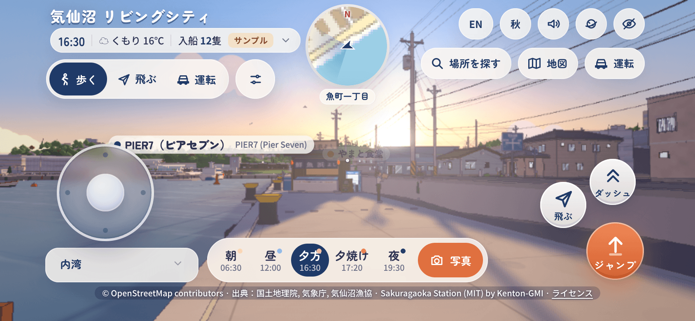 | 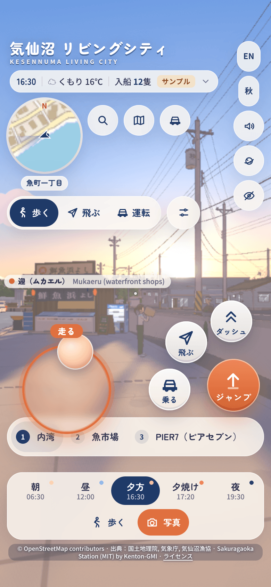 |

### Fly (飛ぶ)

Primary 上昇 (hold), then 下降 (hold), 加速 (hold) and 歩く (land). Stick is still the horizontal move; the buttons are
the vertical axis and the boost.

| Portrait | Landscape | 上昇 held |
|---|---|---|
| 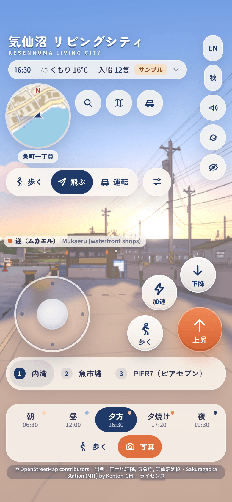 | 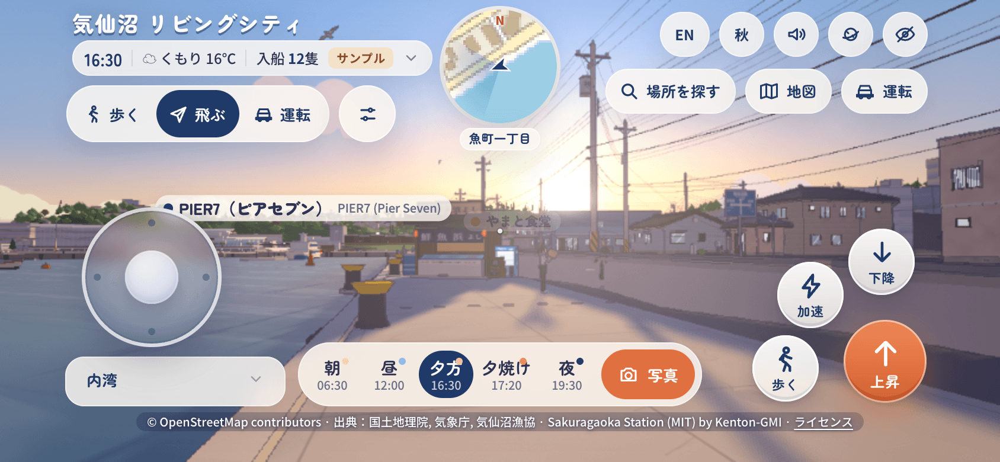 | 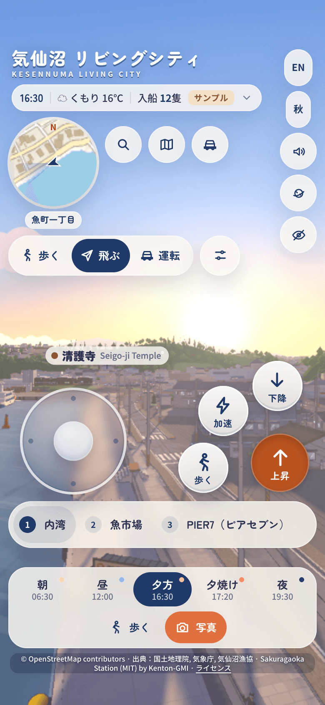 |

### Drive (運転)

Stick: up is throttle, down is reverse, left and right steer. Primary ブレーキ (hold, handbrake), then ブースト (hold)
and 降りる. A speed chip shows above the dock and the pad lifts clear of it. A drag on the right looks around from the
chase camera.

| Portrait | Landscape | ブースト held |
|---|---|---|
| 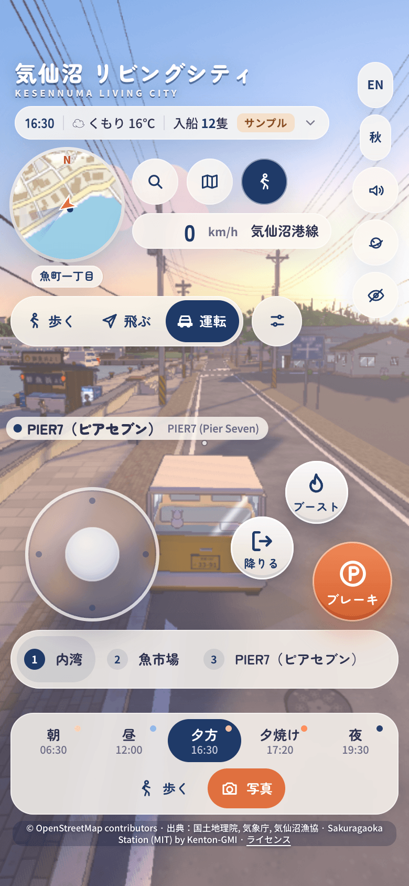 | 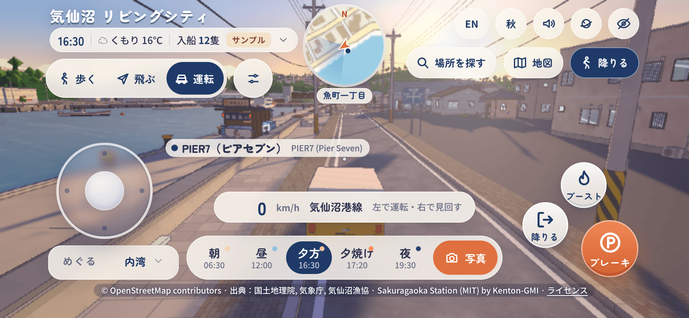 | 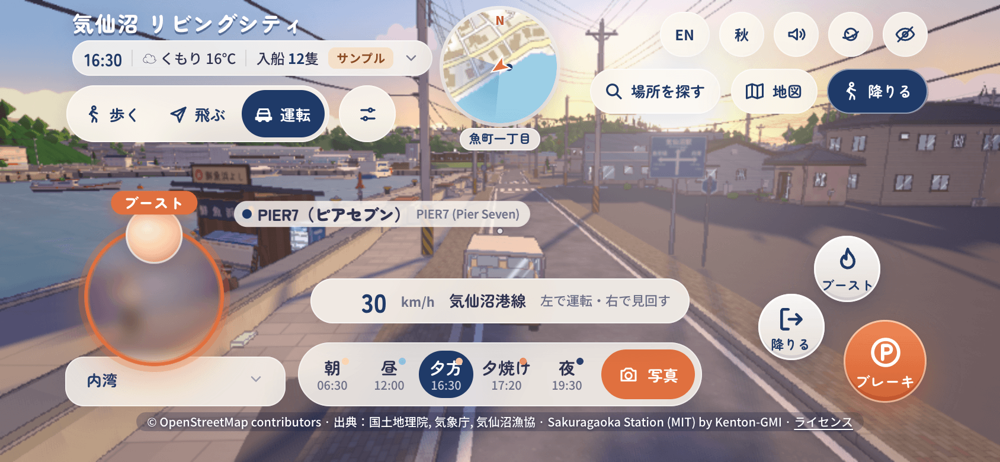 |

### Sail (第一昭福丸)

At the helm of the ship (the voyage's Act 1, from the コの字岸壁 under かなえ大橋; see [ship/SHOFUKUMARU.md](ship/SHOFUKUMARU.md)).
The stick is the helm: up / down moves the engine telegraph (it stays where you leave it, like a ship's), left / right puts
the rudder over (back to midships when you let go). A drag on the right looks around the chase camera. Primary 停止 (the
engine to stop; the autopilot stays off until you touch the stick), then 自動操船 (toggle, shows whether the autopilot
has her), 4× (hold: time compression; it is not a helm input, so the autopilot keeps her under 4× and only the stick takes the helm)
and 町へ戻る (leave the voyage: you are back on the quay, on foot or flying as you boarded, at the hour you boarded). The stick's
full-ahead tag reads 全速 at the helm (走る on foot). The 歩く / 飛ぶ / 運転 chip is hidden while she sails.
The ship's top row (the act chips, 船のデータ, language) clears the notch; its panel is a slim strip at the top right of
the gear (speed, heading, the horn). In every beat that is not at the helm (the berth, the send-off, the ocean, the haul with its
キープ / 放流 buttons, the chain cards, the final card) the voyage UI owns the bottom of the screen and the pad is hidden
(`pad.suppress('ship-beat' | 'ship-card')`), so nothing of it can sit on those panels. The cards start under the top row and keep their
footer (次へ / もう一度出船 / 町へ戻る) pinned at the card's bottom edge; a card taller than the screen (landscape) scrolls by touch
(the pad's touchmove guard lets `#klc-ship .inner / .panel / .facts` through).

| Portrait | Landscape |
|---|---|
| 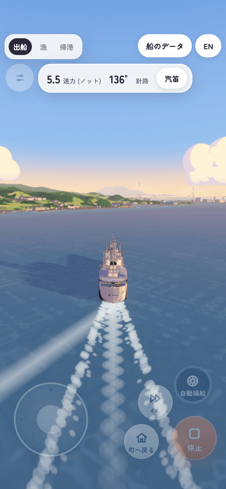 | 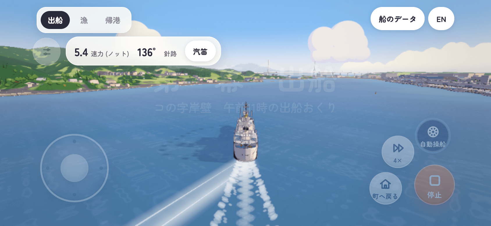 |

The voyage beats on a phone, after the two review rounds (the decluttered HUD: the pad is hidden, the voyage UI owns the screen, the
caption is one line, the card footers are pinned):

| Act 2 (wait), portrait |
|---|
| 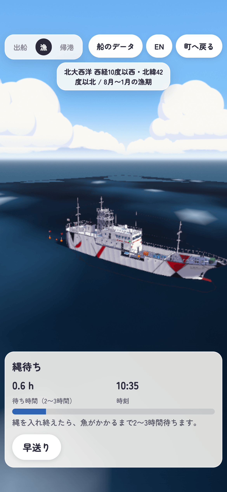 |

| Ocean set, landscape | Final card, landscape |
|---|---|
| 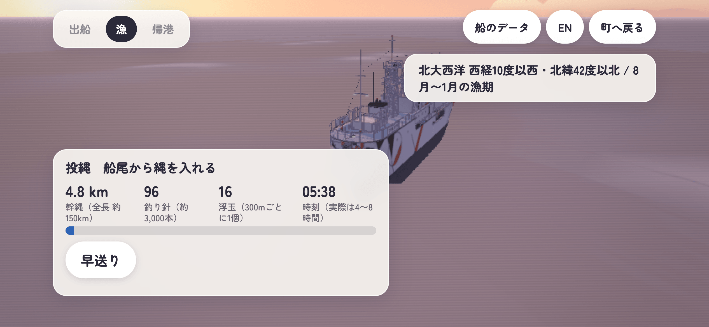 | 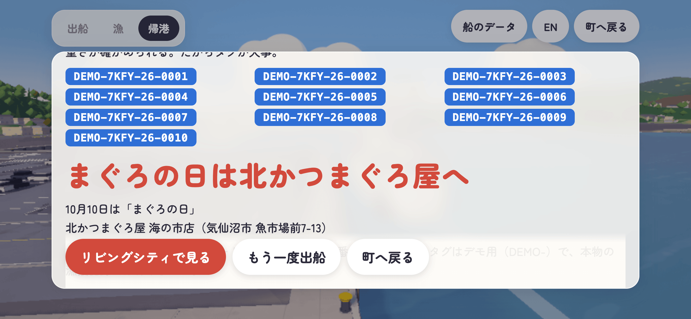 |

### Other screens

| First-run coach mark | Settings | Left-handed | English |
|---|---|---|---|
| 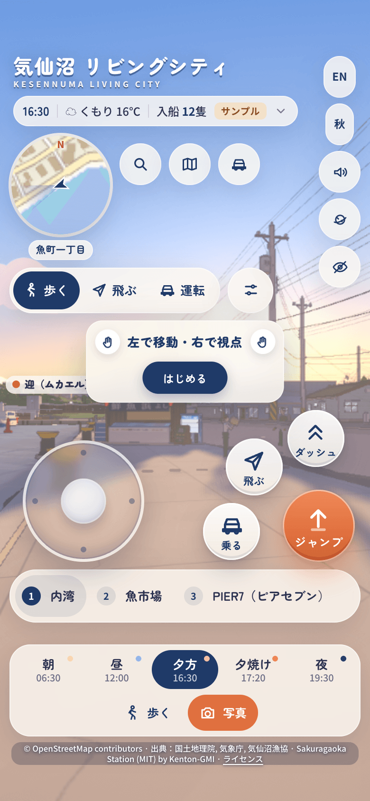 | 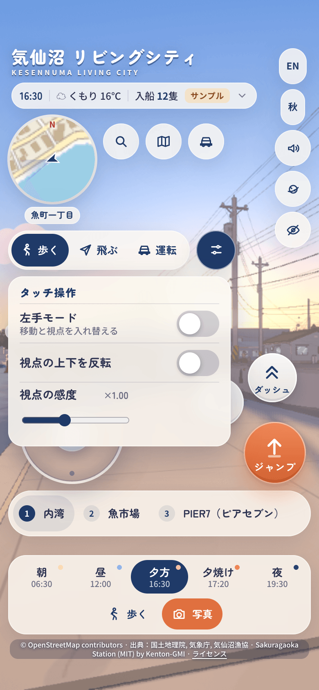 | 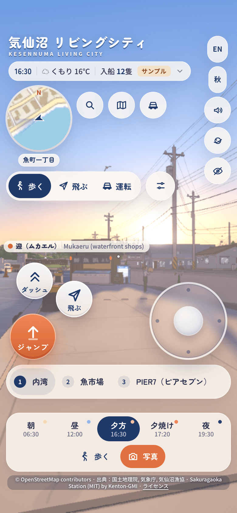 | 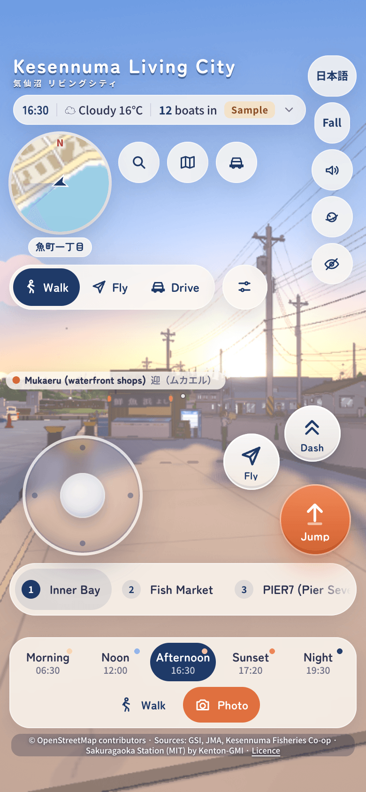 |

## Portrait HUD (390 × 844)

With the pad on and the phone upright (`max-width: 720px` and portrait, under `body.klc-pad`; `ui/touchpad-style.js`) the screen
stops being a web page's. Landscape keeps its own layout (below), desktop and a tablet are unchanged.

| Before: title bar, minimap, three buttons, chip, five icons, strip, dock | After |
|---|---|
|  | 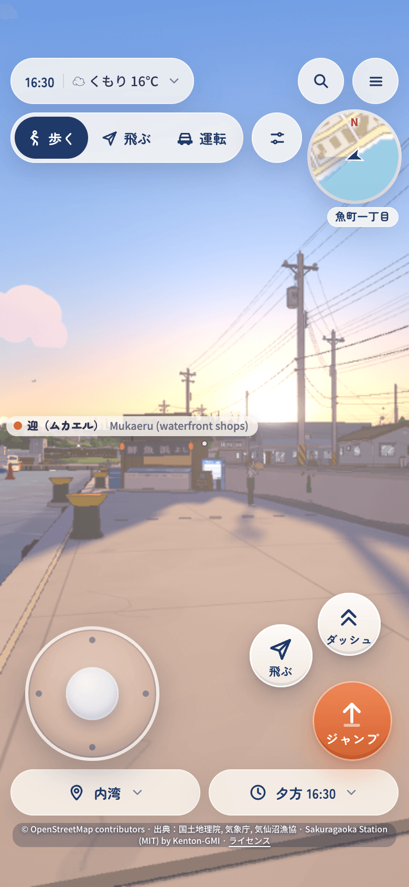 |

- **One top bar:** the time and weather chip (tap: today's arrivals) at the left, 🔍 search and ☰ at the right. The wordmark moves
  into the menu.
- **☰ menu:** language, season, sound, tiny planet, ⓘ credits and licence, hide UI and 修正を報告 (the report sheet, [contrib/APP.md](contrib/APP.md); the last item, so nothing above it moved), as a labelled list. ☰ then the item: two taps.
  ⓘ opens a small credits sheet (the attribution text, a 44 px licence link and a 44 px close); the 8 px credit line at the bottom is
  text only on a portrait phone, so there is no 40 x 11 px link to hit.
- **Mode chip and gear** (the pad's) sit under the bar; the minimap is a small disc at the right (tap: the full map; the
  map and drive buttons are gone from the bar, the mode chip and 乗る drive).
- **Bottom row:** two pills, the place (「内湾 ▾」) and the time of day (「夕方 16:30 ▾」). Each opens a **bottom sheet**: the places
  strip (the 自動で巡る chip first, then the stops; the edge that has more stops fades), or the time dock (five times of day,
  歩く / ドローン, 写真). A sheet, the ☰ menu, the arrivals list, search and the full map
  are modal: the pad steps aside while one is open, and a touch outside closes the sheet or the menu.
- **Credit line:** unchanged text, 8 px, at the very bottom, under the pills. The minimap steps aside while the ☰ menu, the arrivals
  list or the credits are open (`body.klc-hud-open`), as it does for search and the map. Every tap target is 44 px or more (the hide-UI
  eye, the time sheet's 歩く / ドローン and 写真, the search close, the map's zoom and close).

| ☰ menu | Time sheet | Places sheet |
|---|---|---|
| 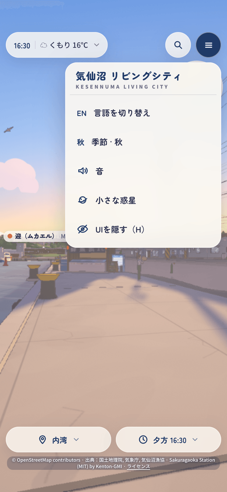 | 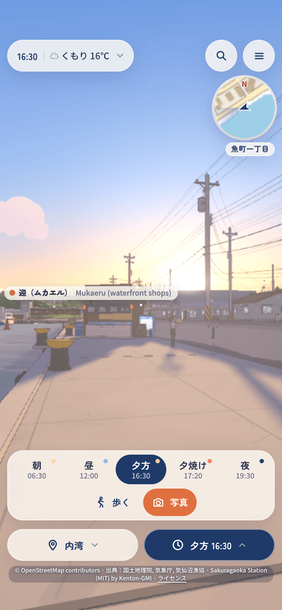 | 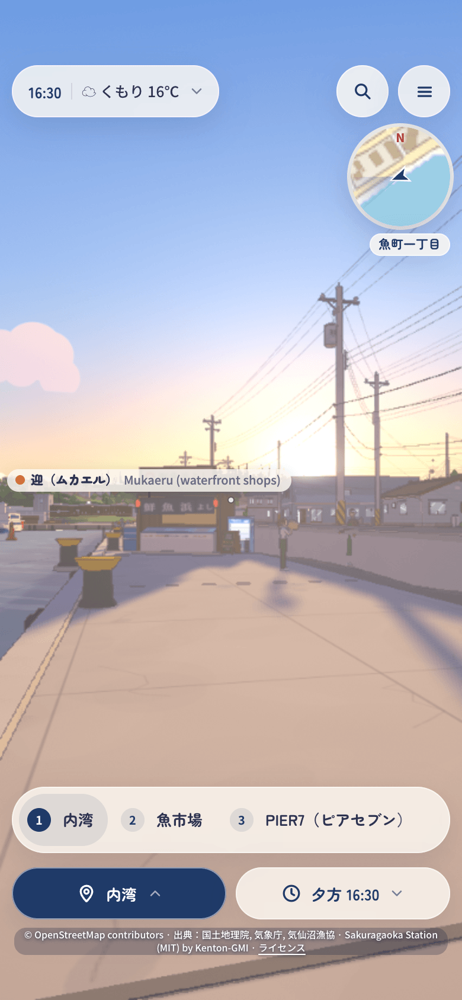 |

| Search | Full map | Landscape (as before) |
|---|---|---|
| 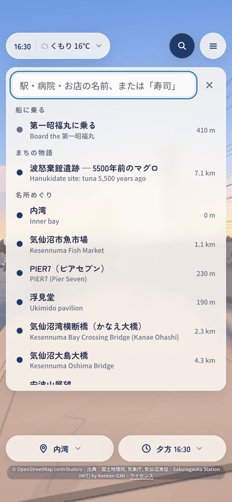 | 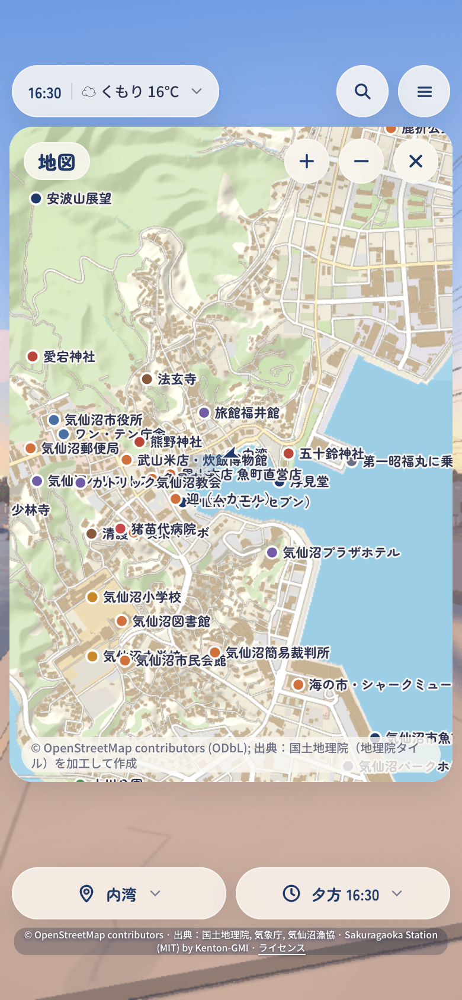 | 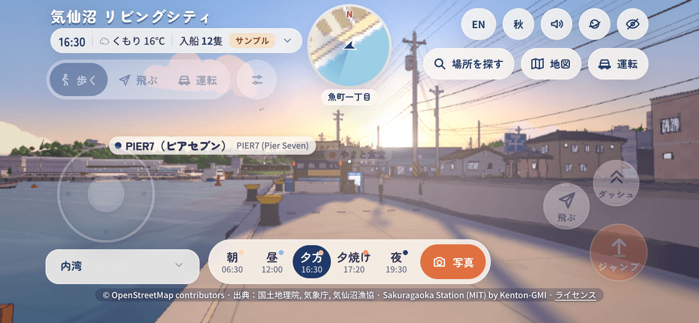 |

Where each thing is, in taps: language, season, sound, planet, hide: 2 (☰, item). A time of day, 写真, 歩く / ドローン: 2 (pill,
item). A place: 2 (pill, place). Search, the full map, today's arrivals, the pad's settings, a drive: 1. The HUD adds only the
`touch.hud.menu` / `touch.hud.credits` / `touch.hud.close` strings (in `data/ui-touch-i18n.json`; `data/i18n.json` is not touched). The pills are HUD panels like the dock
(`HUD_GRAB`): a drag that starts on one is the stick or the look; a tap opens the sheet.

## Gestures

| Gesture | Where | Result |
|---|---|---|
| Touch and drag | lower 75 % of the left half | floating stick: the base appears under the thumb, the knob follows, release springs home |
| Push past 85 % of the travel | stick | run / boost / fast flight (coral ring, tag 走る or ブースト) |
| Drag | anywhere else that is not a button | look (0.008 rad per CSS px, pitch clamped to 85 degrees) |
| Tap | a button | action; `hold` buttons stay active while the finger is down, `toggle` buttons flip |
| Tap | places strip, time dock, minimap, mode chip | the panel's own click (a tap is a touch that moves 10 CSS px or less) |
| Drag that starts on a panel | the same panels | after 10 CSS px the pad takes it (stick or look, by where it landed); the panel sees no click |
| Several fingers | everywhere | each touch keeps its identifier: move, look and buttons at the same time |
| Pinch, double-tap | anywhere | blocked (no browser zoom) |

## Settings

The gear next to the mode chip. Stored in `localStorage` key `klc.pad.v1` (inside try/catch, so private mode simply forgets).

| Setting | Effect |
|---|---|
| 左手モード (left-handed) | swaps the sides: stick on the right, look on the left, buttons arc at the bottom left |
| 上下を反転 (invert Y) | flips the vertical look direction (flight-stick style). The same switch the desktop 操作設定 sheet uses |
| 視点の速さ (look speed) | multiplies mouse and touch look, 0.3 to 2.5, default 1. At 1 a pointer-lock pixel is 0.0022 rad and a touch pixel is 0.008 rad |

## Details

- **Left: floating stick.** A ghost ring rests bottom-left. A thumb landing anywhere in the lower 75 % of the left half puts
  the base under it; the knob follows (56 CSS px of travel, scaled to 0.8 to 1.15 by screen size). 12 % dead zone, eased
  (smoothstep) magnitude. Past 85 % of the travel the ring turns coral and the tag says 走る (on foot) or ブースト (in a
  car): that is RUN / BOOST / fast flight. The knob springs home on release.
- **Right: look.** Drag anywhere that is not a button: 0.008 rad per CSS px (about 85 degrees for a 190 px swipe; times the look speed, 0.3 to 2.5), light smoothing
  (35 ms), pitch clamped to 85 degrees by the player. The top quarter of the stick's half also looks.
- **Thumbs on panels.** A touch that lands on the places strip, the time dock, the credit line, the minimap or the mode chip
  is a tap until it moves more than 10 CSS px; then the pad takes it (the stick or the look, by where it landed) and the
  panel never sees a click. A strip that scrolls sideways keeps a drag along its axis. Inputs and the settings keep theirs.
- **Multi-touch.** Every touch keeps its identifier: stick, look and buttons work at once.
- **Buttons** (right bottom, an arc around a big primary button, 56 px or more, SVG icon plus short JA label, a pressed
  state, `navigator.vibrate(8)` where supported):

| Mode | Buttons (first is the primary) |
|---|---|
| walk | ジャンプ, ダッシュ (toggle), 飛ぶ, and 乗る (near a road the car can start on) or 入る (near an interior door; 出る inside) |
| fly | 上昇 (hold), 下降 (hold), 加速 (hold), 歩く (land) |
| drive | ブレーキ (hold, handbrake), ブースト (hold), 降りる |

- **Top left: mode chip** 歩く / 飛ぶ / 運転 (quick switch) and a settings button: 左手モード (swap sides, persisted),
  上下を反転 (invert Y) and 視点の速さ (look speed, 0.3 to 2.5). The desktop toolbar's 操作設定 opens the same two look controls. Settings live in `localStorage` key `klc.pad.v1`
  (inside try/catch: private mode just forgets).
- **First run:** a coach mark 「左で移動・右で視点」, dismissible, shown once.
- **A touch ends a flight.** While a flight to a place runs the pad is out of the way, and a touch on the canvas takes the camera back: the flight
  is finished with `tour.skip` (a quarter-second glide when it is near its destination, a dip to the sky's colour when it is far; `ui/veil.js`),
  the pad is back as soon as the flight is over, and that touch is spent on it (it starts no stick and no look: the next one does). A touch on a
  HUD button does not end it, and the auto tour is left alone (its own pause button, or G).
- **Hidden** during the intro card, the auto tour and its flights, the tiny planet, photo mode and cinematic mode
  (`body.noui | shot | klc-photo | cinematic | film`), and while a modal HUD panel is open (the ☰ menu, a bottom sheet, the arrivals
  list, search, the full map, the 修正を報告 sheet: `pad.suppress('hud-sheet' | 'xui' | 'contrib')`) or the voyage UI owns the screen (`'ship-beat' | 'ship-card'`). **Fades** to 70 % after 4 s without a touch (it was 35 %: a label measured 2.1:1 on the sky; the UI round notes (ui-b2, not included)); any touch restores it
  at once.
- **iOS hardening:** `touch-action: none` on the canvas and the pad, `preventDefault` on touchmove (scrollable panels
  excepted), `gesturestart|change|end` blocked, double-tap zoom blocked, viewport `maximum-scale=1, user-scalable=no`,
  `-webkit-touch-callout: none`, `user-select: none`, `dvh` / `svh` for the height and `env(safe-area-inset-*)` on every
  edge, re-laid out on resize, rotation and when a panel changes size.
- **Layout.** The pad measures the dock, the places strip, the credit line and the car's speed chip and lifts the
  cluster and the ghost stick clear of them; the mode chip sits under the brand and the minimap. While the pad is on
  (`body.klc-pad`) `touchpad-style.js` re-seats a few existing panels per orientation (minimap, search / map buttons).
  `test/mobile-pad.e2e.test.js` measures every pad rectangle against every panel in portrait (390x844) and landscape
  (844x390).

## iOS notes

See the `iOS hardening` bullet above. In addition: Safari ignores `user-scalable=no` for accessibility, so the pad also blocks
`gesturestart|change|end` and the double-tap; the canvas and the pad use `touch-action: none`; heights use `dvh` / `svh` so
the collapsing URL bar does not move the buttons; every edge reads `env(safe-area-inset-*)` (the home indicator and the
notch in landscape). Haptics (`navigator.vibrate`) do nothing on iPhone Safari, so the pressed state carries the feedback.
A phone-tier build (smaller atlas, forced on touch devices) keeps the page inside iOS's memory limit.

### iPhone survival and the dbg strip

- **`?dbg=1`** prints a monospace strip at the top of the screen (it takes no touch and is never in a photo; without the flag the
  code is not even requested): the OS and Safari versions (iOS 26 freezes the OS in the user agent at 18.x, so trust the Safari
  number), `innerWidth x innerHeight` against `visualViewport` and the `100svh` / `lvh` / `dvh` / fixed boxes with the gap between
  `innerHeight` and `100svh` (a gap above 0 means the 3D view is not the box the HUD lives in), the safe-area insets, the canvas and
  HUD boxes, texture and geometry counts, the audio state and session type, WebGL context losses, the last errors and the time to
  ready. Screenshot it in a Safari tab (portrait and landscape) and in a Home Screen install. Code: `ui/dbg.js`.
- **A lost WebGL context** (iOS does this under memory pressure and after a long stay in the background) cannot be repaired in place:
  the phone tier frees the static batches' CPU arrays once they are on the GPU, so nothing can be re-uploaded. The page stops drawing,
  shows a card 「再読み込みします」 with a 44 px button, saves the pose, and reloads when the browser gives the context back (or after
  4 s of a visible page without it). Two automatic reloads in two minutes are refused: the card then waits for the button. After the
  reload the camera, the time of day and the season are put back once (within five minutes; not over a `?cam=` link). The state
  machine and its tests: `core/survive.js`, `test/survive.test.js`. Check by hand: Web Inspector console,
  `__survive.phase`, or lose the context with `WEBGL_lose_context` (`tools/anime/ui-c-check.mjs --steps survive`).
- **Sound.** The page asks for the `playback` audio session, so the ring/silent switch does not mute the town (this needs a phone to
  confirm: headless Chrome has no silent switch), and any touch resumes an AudioContext that a call, Siri or the lock screen
  interrupted. A touch does not undo the mute button. While the town makes sound, another app's music stops (a `playback`
  session does that); muting or hiding the page releases the session. Code: `core/audio-session.js`.

### Photos on a phone (写真, key P)

- **Size and framing.** On the phone tier (or a coarse pointer) 写真 renders **1920 px on the long side at the screen's own aspect**
  (887 x 1920 on a 390 x 844 phone; a fifth of 4K's pixels), with the camera's field of view from the same function the screen uses
  (`core/fov.js`, `ctx.fovFor`): the picture shows what the screen shows, about 48 degrees across on a phone held upright. It used to be a 16:9
  frame with the portrait camera (about 120 degrees across) at 3840 x 2160, which cost +775 to +945 MB of footprint. A desktop is unchanged: 4K,
  straight to Downloads. While the PNG is encoded the main loop draws nothing (`ctx.shooting`).
- **The card.** A tap on 写真 puts a card up at once (撮影中…), then it shows the picture with 保存・共有. The button's own click calls
  `navigator.share` with the PNG as a file (iOS needs the user gesture, and a photo takes a second to render, so the share is never started
  after the render): the iOS share sheet's *Save Image* goes to Photos, and AirDrop and LINE are there too. A browser that cannot share files
  gets a 保存 button that downloads the PNG. 保存しました appears only after the share sheet (or the download) has resolved; dismissing the
  sheet leaves the card up and says nothing. The card takes the pad aside, closes with Escape or 閉じる, and sits above the HUD and the ship UI
  and below the report sheet and the reload card. Press and hold on the picture is the browser's own save (iOS keeps its callout there).
  Code: `ui/photo.js`, `ui/photo-share.js`, strings in `data/ui-photo-i18n.json`; the HUD's `photo()` only passes the note and the language.
- **Tools.** `__photo(scale, { noDownload: true })` still returns the PNG's size (and `data: true` the data URL) without a card or a download.

### The loading card

- **Fonts.** The card waits for its web fonts, at most 2 s from the script that holds it (the Google Fonts stylesheet is render-blocking, so that
  script starts when the stylesheet has arrived), then fades in: it never reflows when the faces arrive. Its height does not depend on the font
  or on the label (a grid footer, one line per line): measured at 17 viewports x 5 font stacks x 3 label states it never moves.
- **The bar.** `core/loadplan.js` gives every stage of `build()` a weight (its measured share of a cold load) and a Japanese label; the finishing work is
  four steps (wires, the phone's slimming, the static batch, compiling the shader programs). The long one is the **static batch**
  (about 20 s on a desktop, 10 s on the phone tier), not the shaders: it blocks the main thread, so the bar's tinted `#creep` layer and the sheen
  on it are CSS transforms that keep moving on the compositor. `window.__loadLog` records what the card said and when; `__stats.finish` has each
  stage's milliseconds and `__stats.firstFrameMs` the first frame's time. `?compile=async` waits for the shader programs (`compileAsync`) instead
  of handing them to the driver, for a device check.
- **One request per data file.** `loadData` shares the first call's promise: `explore.json` (2 MB) is fetched once, not by each of its three users.

## Game API

```js
const pad = ctx.pad;                    // also window.__pad

pad.move            // THREE.Vector2: x right, y down, length 0..1 (dead zone out, eased). player.touchMove returns it
pad.running         // the stick is past 85 %
pad.takeLook(dt)    // { dx, dy } radians for this frame; finger right = dx > 0, finger down = dy > 0
pad.isDown('brake') // is a hold button down
pad.vertical        // +1 while 上昇, -1 while 下降;  pad.dash  the ダッシュ toggle;  pad.brake / pad.boost
pad.mode            // 'walk' | 'fly' | 'drive' | a registered name
pad.hidden          // true while the pad is out of the way (intro, tours, a flight to a place, photo); a touch while it is hidden for a flight ends the flight
pad.suppress('why', true | false)   // hide the pad for your own reason (a cutscene); pad.suppressed lists the reasons now
pad.setToggle('auto', on)           // a toggle button's pressed state, set by the game (the autopilot can also change by itself)
pad.on((e) => ...)  // { type: 'down' | 'up' | 'action' | 'mode' | 'settings', id, mode }; returns the off function
```

`Player.attachPad(pad)` (main.js) makes the player consume `pad.move`, `pad.takeLook()` and the `action` events `jump`,
`fly`, `land`; `player.touchMove` is kept as a getter for older callers. `drive.js` reads `ctx.pad.move`
(throttle = -y, steer = x), the ブレーキ and ブースト buttons, and gives the touch look to the chase camera
(`player.lookSink`). `drive.canEnter(r)` tells the 乗る button whether a road is within `r` metres.

### Registering a mode (the sail mode of 第一昭福丸, `world/ship/padmode.js`)

The example below is the shape; the real registration is `sailPadSpec()` in `src/anime/world/ship/padmode.js` (labels from
`data/ship/i18n.json`, icons of its own, `visible` so that 停止 / 自動操船 / 4× show only at the helm). `mountSailPad(ctx, { sail, voyage })`
keeps the pad in step: it finds `ctx.pad` when it appears, calls `setMode('sail')` while the voyage is active and `setMode(null)`
when it ends, suppresses the pad outside the helm, and keeps the 自動操船 toggle on the autopilot's state with `pad.setToggle('auto', on)`.

```js
pad.registerMode('sail', {
  stick: 'none',                                // 'analog' (default) or 'none': with 'none' every touch looks
  buttons: [                                    // the first one is the big primary button; up to 7 fit the arc
    { id: 'stop', label: '停止', icon: 'brake', onDown: () => sail.stop() },
    { id: 'auto', label: '自動操船', icon: 'boost', toggle: true, onDown: (pad, on) => sail.auto(on) },
    { id: 'x4', label: '4×', icon: 'dash', hold: true, onDown: () => sail.speed(4), onUp: () => sail.speed(1) },
    { id: 'home', label: '町へ戻る', icon: 'land', onDown: () => sail.home() },
  ],
  onEnter: (pad) => {}, onExit: (pad) => {},    // optional
});
pad.setMode('sail');      // show it; the pad no longer follows the player / car by itself
pad.setMode('walk');      // (or null, or 'auto') hand the buttons back: walk / fly / drive follow the game again
```

A button is `{ id, label, icon, hold?, toggle?, visible?, onDown, onUp }`.

- `label`: a string, `{ ja, en }`, a function returning either, or one of the pad's `touch.*` string keys.
- `icon`: a name from `ICONS` in `touchpad.js` (jump dash fly board enter leave up down boost land brake nitro getout walk
  car sliders) or raw `<svg>` markup. Use `currentColor` and a 24x24 viewBox.
- `hold`: the button is held while the finger is down (`pad.isDown(id)`, `onDown` on press, `onUp` on release).
  `toggle`: each tap flips it (`onDown(pad, on)`); the button shows the pressed state.
- `visible`: a function; polled each frame, the button pops in or out (its slot in the arc stays put).
- Every press also emits `{ type: 'down' | 'up', id, mode }` on `pad.on`.
- `registerMode` throws for the built-in names or duplicate ids; `setMode` throws for an unknown name.
- Language: the pad follows the HUD's (`ctx.services.life.hud.i18n.lang`).

`explore/sail.js` reads the pad's stick (`player.touchMove` is the same vector once the pad is attached) and takes the pad's look through
`player.lookSink` like the car does; it has no touch code of its own. `player.lookCapture` (a mode that owns the camera takes the
legacy pixel drag, which is only a mouse now) and `lookSink` (radians from the pad) are separate paths.

## How to test

By hand on a desktop: open `http://localhost:<port>/?touch=1` (add `&lang=en` for English). The buttons work with a mouse;
the stick and look need real touches, so use Chrome DevTools device mode or the CDP test below. `?touch=0` forces the pad off.

```sh
env -u NODE_OPTIONS bun test test/mobile-pad.test.js test/ship-pad.test.js test/phone-hud.test.js   # pure parts, fast (also part of bun test)
tools/anime/gate.sh chrome env -u NODE_OPTIONS KLC_E2E=1 KLC_E2E_PORT=8991 bun test test/ship-pad.e2e.test.js   # the portrait HUD and the ship on the pad, real touches
tools/anime/gate.sh chrome env -u NODE_OPTIONS bun tools/anime/integrate-shots.mjs [--only town,menu,sail,voyage,net]   # docs/shots/integrate/ (net lists what the public mirror would refuse)
tools/anime/gate.sh chrome env -u NODE_OPTIONS KLC_E2E=1 bun test test/mobile-pad.e2e.test.js   # headless Chrome, port 8981
tools/anime/gate.sh chrome env -u NODE_OPTIONS bun tools/anime/pad-shots.mjs [--only walk,fly,drive,coach,settings] [--q lang=en --prefix en_]
```

`bun test` alone skips the end-to-end file (it needs the Chrome lock). The e2e test is an iPhone-shaped page (390x844 at
DPR 3, `mobile`, iPhone UA, touch emulation, `Emulation.setSafeAreaInsetsOverride`) and real touches through
`Input.dispatchTouchEvent`; helpers in `tools/anime/pad-lib.mjs`. In CDP a `touchEnd` lists the points that lift, the
others stay down.

Screenshots (`docs/shots/mobile/`, 390x844 and 844x390 at DPR 2 with iPhone safe-area insets): `walk_*`, `fly_*`,
`drive_*` in `portrait` and `landscape`; `*_stick_run` (the thumb past 85 %: coral ring and the 走る / ブースト tag),
`fly_*_rise` (上昇 held), `drive_*_boost`, `coach_*` (first-run mark), `settings_portrait`, `walk_portrait_lefthanded`,
and `en_walk_*` (English labels).

## Phone review, rounds 1 and 2 (integrated app)

Round 1 (`faa7e2d`): 4× / Shift no longer takes the helm from the autopilot; the cards scroll by touch and sit under the top bar with a pinned footer; the landscape search sheet reaches the 第一昭福丸 row; 自動で巡る is the first chip of the portrait places sheet; 44 px targets (the hide-UI eye, the time sheet, search close, map zoom / close), ⓘ credits in the menu; the minimap steps aside for the menu, arrivals and credits; 町へ戻る restores walking or flying and the boarding hour; the stick tag reads 全速 at the helm. Checks: `test/integrate-fix1.test.js`, `test/integrate-fix1.e2e.test.js`, `docs/shots/integrate/fix1_*.png`.

Round 2 (`130b6f6`):

- The 昭福丸 boarding chip hides while the places / search sheet, the full map or any pad-suppressing sheet is open (it no longer covers the 第一昭福丸 row).
- While the pad's settings popover (the gear) is open, `body.klc-pad-set` folds the HUD dock and the places strip away, so nothing sits under it (landscape).
- The desktop restore eye is unchanged (38 px at 18 / 18); the 44 px one at 14 / 14 is `body.klc-pad` only. 「まちへ出る」 is 44 px tall.
- Act 2 of the voyage on a phone: the 「どこの海」 caption is its bold line only (the season / ICCAT text and the Japan quota paragraph are in 船のデータ); in landscape the panel is at most 60 % of the height with one-row meters and the 早送り row pinned.
- Checks: `test/integrate-fix2.test.js` (static) and `test/integrate-fix2.e2e.test.js` (real touches); screenshots `docs/shots/integrate/fix2_*.png`.

## UI batch B (2026-10-05)

Rows 8, 11, 13 and 12 of the UI review plan (not included), CSS and small handlers only:

- **Intro card.** `#intro` is `100dvh` and scrolls; under 460 px tall the card is compact (the title follows the height, the key list and the second language line fold away) and its footer, with 「まちへ出る」, is pinned to the bottom, so the button is on screen at 844 x 340 and 667 x 300 (it fell off at both). The exit is 360 ms with a 10 px lift, no `backdrop-filter`, and `display: none` after the fade. A touch screen shows no focus ring on the button. The rules live in `index.html`'s own `<style>` (UI lane C pasted them there in round 2 so they apply from the first paint; in round 1 they were in `ui/style.js` and arrived when the HUD mounted, and UI lane B deleted that copy), and `main.js` focuses the button only for a fine pointer. The button's 1 px hover lift is behind `@media (hover: hover) and (pointer: fine)` like every other `:hover` rule.
- **Ship top bar.** `#klc-ship .top` has `z-index: 2`, so 船のデータ, the language button and 町へ戻る take the tap on the four card beats (the scrim used to cover them); the card starts under the bar on every layout. Labels are `nowrap`, the tools are 44 px, and the long English labels have a short form under 480 px (`ship.btn.facts.short` Facts, `ship.btn.exit.short` Town; the full label stays the accessible name). Under 420 px the bar tightens so 375 and 360 px fit one row.
- **Story card.** `box-sizing: border-box` (the card was 34 px too wide: right edge at 393 / 408 / 448 px on 375 / 390 / 430 px screens), a landscape rule (left 46 %, from the top, inside the notch insets, up to the full visible height), `data-scroll` so the pad's touchmove veto lets a swipe scroll it, a 44 px close button on touch (the title is balanced beside it), and `relang()` called by the explore UI when the HUD's language changes.
- **Search.** 16 px field (44 px on touch), one close button (the native clear button is hidden), `enterkeyhint="search"`, no autocapitalize / autocorrect. Enter that confirms a Japanese conversion (`isComposing`, or keyCode 229 on WebKit's keydown after `compositionend`) neither closes the sheet nor flies to the first result. The placeholder is short enough to show whole (`v4.x.searchPh`). The minimap is not drawn while search or the full map is open. With the on-screen keyboard up (`visualViewport` shorter than the layout viewport by more than 120 px) `explore/ui.js` sets `--vvh` and `data-kb="1"` on `#klc-x` and the sheet ends above the keyboard (a phone on its side moves it to the top).
- Checks: `test/ui-b-fixes.test.js` (CSS by selector, the handlers on a DOM stub) and `test/ui-b.e2e.test.js` (headless Chrome through the gate: an iPhone-shaped page with real touches, then a 1440 x 900 desktop page).

## UI batch B round 2 (2026-10-06)

Rows 6, 7 and 14 of the same plan, all CSS:

- **Press.** Every HUD, explore and ship button (and the boarding chip, the story card's ✕, 「まちへ出る」) scales to `0.97` on `:active` in 140 ms on `--ease-out`; the pad's buttons to `0.95` (they were `0.92`), and a press on them is a plain ease-out (only the entrance and the release overshoot). List rows (a stop, a search result) and the ☰ menu's rows press by background instead. Every `:hover` rule is inside `@media (hover: hover) and (pointer: fine)`. The focus ring is navy between two white bands (inside the row for a list row). The motion tokens (`--ease-out`, `--dur-press`, `--dur-enter`, `--dur-sheet`, `--shift`, `--pop-scale`, ...) are on `:root` in `ui/style.js`. `html` has `overscroll-behavior: none`.
- **The ☰ menu, the two sheets and the credits (portrait phone, `body.klc-pad`).** They take touches on their padding too (a touch there used to reach the 3D view and close the sheet) and they move: entry from `display: none` with `@starting-style`, exit with `transition-behavior: allow-discrete`. The menu grows out of the ☰ button (220 ms in, 140 ms out), a sheet rises 24 px (280 ms in, 200 ms out), a sheet replaced by the other leaves at once, the arrivals popover grows out of its chip. No scrim. The pad leaves in 140 ms and returns in 220 ms. Where `allow-discrete` is missing (before Safari 17.4) they appear and vanish as before.
- **Legibility.** One accent, `#c4521f`, for every fill that carries white text (the 写真 pill, the pad's primary button and run tag, the ship's primary buttons, the boarding chip); `--k-muted` is `#55596f`; the credit line's pill is `rgba(18, 26, 52, .62)`; the pad idles at 70 % (it was 35 %); the hide-UI eye is a `.9` disc at `.8`; a soft veil sits under the wordmark.
- **Landscape story card.** It ends 104 px above the bottom inset, so it no longer covers the top of the time dock at 844 x 390 (a phone under 721 px wide on its side is not covered by this).
- Checks: `test/ui-b2-press.test.js`, `test/ui-b2-sheets.test.js`, `test/ui-b2-legibility.test.js`, `test/mobile-native-lint.test.js` (CSS by selector and at-rule, WCAG arithmetic) and `test/ui-b2.e2e.test.js` (headless Chrome through the gate; the transitions are read from the running animations because the gated Chrome draws about 5 frames a second).
