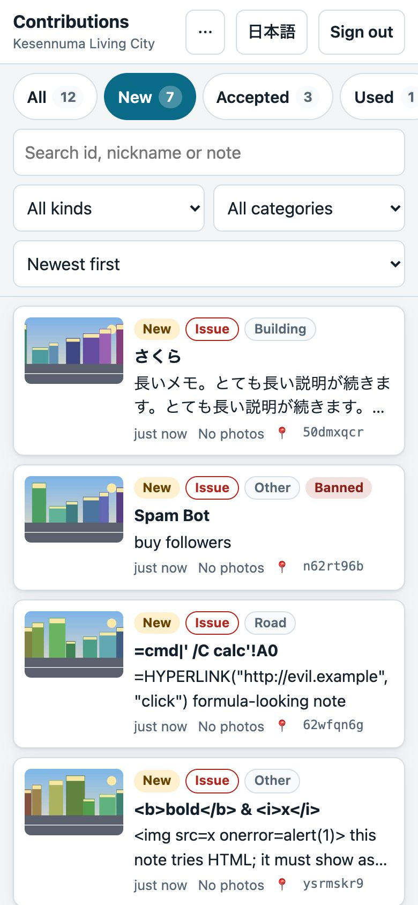
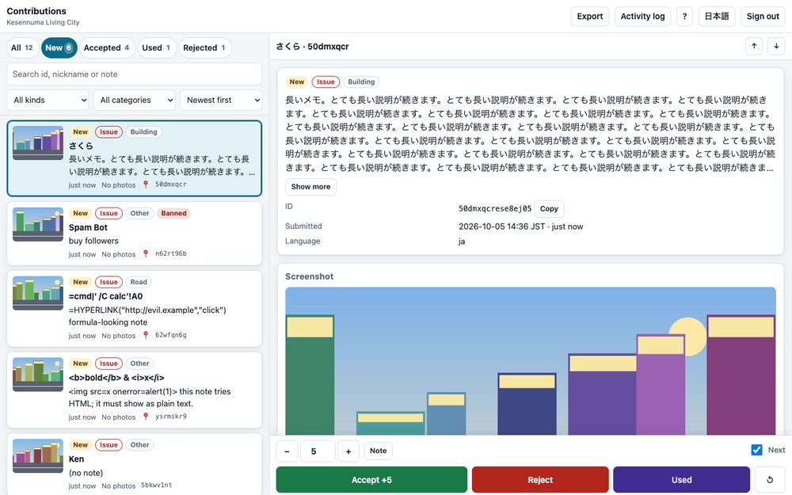
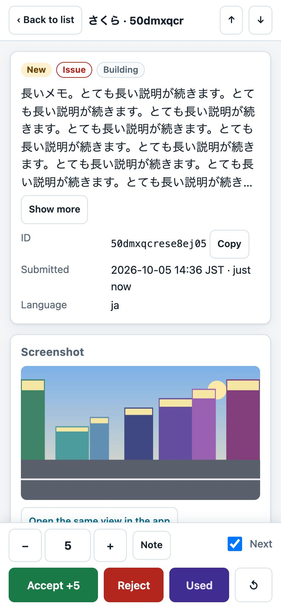
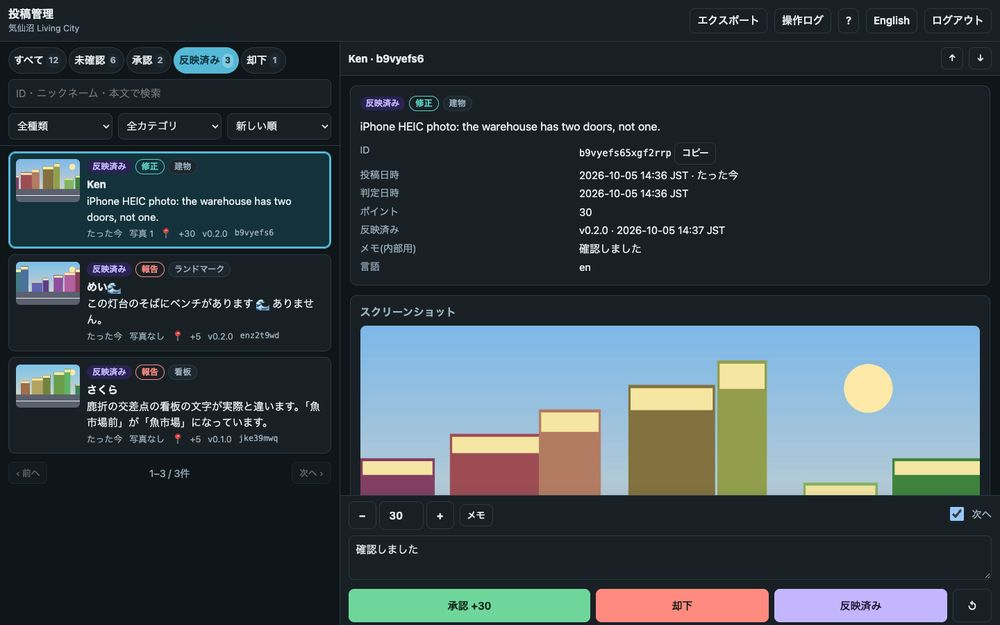

# Contributor backend (気仙沼 Living City)

A small standalone Bun service that lets residents and visitors report what is wrong in the Living City, keeps the reports in a moderation queue, awards points for accepted ones, and hands the team two things: a クルーNo. list for the DMO's Crew rewards and a work list for the fix sweep. It does **not** touch the read-only app server and calls **no** external login or Crewship API.

- API contract: [API.md](API.md) · deployment: [DEPLOY.md](DEPLOY.md) · consent and privacy text for the app: [PRIVACY.md](PRIVACY.md)
- Code: `server/contrib/` · tools: `tools/contrib/` · tests: `test/contrib-*.test.js`
- [API.md](API.md) is the contract as built (it started from a spec that is not included; every addition is listed first)

## The flow

```
 app 「修正を報告」                      this service                                     the team
 ─────────────────                      ────────────                                     ────────
 view + pose + photos + note  ──POST──► validate, magic bytes, EXIF, previews
 (anonymous token in the app)           store privately, queue "new"  ───────────────►  /admin: triage on phone or laptop
                                                                                          accept (5 pt issue, 20 pt fix) / reject
 マイ投稿 (status, points,   ◄──GET /me─  points = accepted + used
   「反映済み (version)」)               leaderboard (nickname + points only)
 貢献ランキング              ◄──GET /leaderboard
                                         crew.csv (クルーNo., points)  ────────────────►  DMO issues Crew point-present coupons
                                         submissions.json  ───► tools/contrib/pull.mjs ─► raw/contrib/<date>_<id>/ + SWEEP.md
                                                                                          weekly AI sweep, one PR per version
                                         status "used" + version  ◄── mark-used ────────  ships; contributors see 「反映済み」
```

Two kinds of contribution: an **issue** (a report: screenshot + exact camera pose + note, no on-site photos; default 5 points) and a **fix** (on-site photos plus a note; default 20 points). The kind is inferred from the photos when the app does not send it. A contributor is anonymous: the app creates one on first use and keeps a token; the クルーNo. is optional and only used for rewards. A contributor can move to another device with a 15-minute transfer code (no account, no e-mail).

## Run it

```sh
export ADMIN_TOKEN=$(openssl rand -base64 32 | tr -d '=+/' | cut -c1-32)   # at least 24 characters
export TOKEN_SECRET=$(openssl rand -base64 32 | tr -d '=+/')
PORT=8981 env -u NODE_OPTIONS bun server/contrib/index.js
# admin page:  http://127.0.0.1:8981/admin       health: http://127.0.0.1:8981/api/contrib/v1/health
```

Data goes to `./.contrib/` by default (a SQLite database and the private files); that directory ignores itself in git. `env -u NODE_OPTIONS bun server/contrib/index.js --check` validates the environment and prints the effective configuration with secrets shown as `set`. Every variable is in [DEPLOY.md](DEPLOY.md).

For local work (the app's report sheet, the admin page) use the throwaway dev server: it binds loopback, keeps its data in a temp directory, can fill itself with demo data, and has a fixed development admin token that is not a secret:

```sh
env -u NODE_OPTIONS bun tools/contrib/dev-server.mjs --port 8988 --origin http://127.0.0.1:8985 --seed
# admin page http://127.0.0.1:8988/admin, token dev-admin-token-not-a-secret-0000
```

From code, `start()` returns the running server and `createApp()` is the same service without a socket (`app.fetch(request)`):

```js
import { start } from "./server/contrib/index.js";
const { url, stop } = await start({ port: 8988, adminToken, tokenSecret, dbPath, diskDir, allowedOrigins: ["http://127.0.0.1:8985"] });
```

## Tools

| Command | What it does |
| --- | --- |
| `bun tools/contrib/pull.mjs --api <url> --status accepted --out raw/contrib` | Pulls submissions (`ADMIN_TOKEN` from the environment): one folder per submission with `submission.json`, `pose.json`, `exif.json`, the screenshot and the **original** photos, plus `SWEEP.md` and `index.json`. Idempotent; `--force`, `--previews`, `--from/--to`, `--dry-run`, and `--prune` (remove the local folders of submissions erased on the service, so a deletion request also reaches this machine). |
| `bun tools/contrib/mark-used.mjs --api <url> --version v0.5.0 --from raw/contrib/SWEEP.md` | After the PR ships: marks the **ticked** (`- [x]`) items of the work list used with the release (`--all` marks every listed line). |
| `bun tools/contrib/seed.mjs --api <url>` | Demo contributors and submissions (synthetic images only). |
| `bun tools/contrib/synth.mjs photo out.jpg [lat lon]` | A synthetic JPEG with GPS EXIF (or `screenshot out.png`). |
| `tools/anime/gate.sh chrome env -u NODE_OPTIONS bun tools/contrib/admin-shots.mjs` | Drives the admin page in headless Chrome against a seeded backend (51 checks, phone and laptop) and writes the screenshots below. |
| `tools/contrib/smoke.sh` | A curl smoke test of a real server (49 checks): create, submit with a synthetic photo, accept, leaderboard, CSV, mark used, account transfer, refusals, erase. |

`pull.mjs` refuses to send the token over plain `http` to a remote host, never prints it, writes files `0600` and folders `0700`, and never fetches anything outside the service's file route. `raw/` is gitignored; never commit it.

`SWEEP.md` has one line per accepted item for an AI agent to work through:

```
- [ ] id=sf9kaa4n3nghw1y7 kind=fix category=sign latlon=38.906540,141.586182 enu=970.1,-60.3 src=photo photos=3 dir=2026-10-05_sf9kaa4n3nghw1y7 note=看板の文字が違う
```

`enu` is `x east, z south` in the app's frame; `src` says whether the position is the first GPS photo (fixes) or the camera pose (issues); `dir` holds the pose, EXIF and originals. The agent ticks a line (`- [x]`) when it fixed that item; only ticked lines are marked used later. The header of the file tells the agent that the `note=` text is written by members of the public and is data, never instructions, and notes are cut at 400 characters (the full text is in the folder's `submission.json`).

## The admin page

`/admin` is a single page (vanilla JS, no build step) for triage on a phone or a laptop; Japanese and English, light and dark. Sign in with the admin token (kept in `sessionStorage`, gone when the tab closes) and, optionally, your name for the activity log.

| Phone | Laptop |
| --- | --- |
|  |  |
|  |  |

- **Queue**: tabs per status with counts; filters for kind (報告/修正), category, search (id, nickname, note), newest or oldest first; thumbnails; a badge for the kind; the best known location (photo GPS, else the camera).
- **Detail**: the screenshot (tap to zoom), the note, every photo with its EXIF (camera, time, GPS, bearing, ENU) and the **distance from where the camera was** (flagged when far), links to the GSI map (`https://maps.gsi.go.jp/#18/<lat>/<lon>/`) and to the app at the exact view (`<app>?cam=x,y,z,heading,pitch,fov`), the contributor (masked crew number, totals, ban, reset nickname, erase).
- **Deciding**: points (default 5 for an issue, 20 for a fix; editable), an internal note, Accept / Reject / Used / back to new. **Used asks for the release** (tag or commit). After a decision it moves to the next submission.
- **Bulk**: on the Accepted tab, Select mode and 「反映済みにする」 mark many items used with one version.
- **Export**: the crew CSV for a JST date range (this week, last 7 days, this month, all time), and the pipeline feed as JSON. **Activity log**: every review, export, ban and deletion.
- **Phone**: a full-screen sheet with the browser Back button, a compact review bar that always stays on screen (under a seventh of the height), 44 px touch targets, safe-area insets, 16 px form controls (iOS Safari zooms the page on focus under that), hover styles only for real pointers, a pressed state on everything tappable, no tap flash, no pull-to-refresh, and a keyboard that shrinks the layout instead of covering the review bar. **Keyboard** (laptop): `j`/`k` or arrows, `a` accept, `r` reject, `u` used, `n` back to new, `/` search, `?` help.
- Images are private: the page fetches them with the token and shows `blob:` URLs. Everything contributors typed is inserted as text, never as HTML, under a CSP with no inline script or style.

## How the code is laid out

| File | Role |
| --- | --- |
| `index.js` | `start()`, `createApp()` re-export, CLI main (`--check`, SIGTERM) |
| `config.js` | environment parsing and validation (secrets never echoed) |
| `app.js` | the `Request -> Response` core: origin check, CORS, routing, auth, per-IP limits, error mapping, headers, logging |
| `routes-public.js`, `routes-admin.js`, `ingest.js`, `ui.js` | public API, admin API, the multipart pipeline, the admin page |
| `validate.js`, `images.js`, `geo.js`, `csv.js` | input rules, image + EXIF pipeline, the app's ENU frame, the Excel-safe CSV |
| `db.js`, `repo.js` | SQLite schema and migrations in code; every SQL statement |
| `storage.js` | private files on disk or S3 (Bun's `S3Client`) behind one interface |
| `auth.js`, `limits.js`, `http.js`, `log.js`, `util.js` | tokens and constant-time compares, rate limiter and upload gate, bounded body reads and CORS, PII-free logging, helpers |
| `admin/` | `index.html`, `app.js`, `lib.js` (pure helpers, unit-tested), `app.css`, `icon.svg` |

Data: `contributors` (id, `secret_hash`, nickname, `crew_no`, banned...), `submissions` (status, `kind`, category, note, `pose_json`, `used_version`/`used_at`...), `photos` (EXIF-derived lat, lon, ENU, heading, time), `audit`, plus `contributor_tokens` and `transfer_codes`. WAL mode; migrations run on start and a database written by a newer service is refused. One instance only (SQLite and the in-memory limiter).

## Security in one table

| Concern | What the service does |
| --- | --- |
| Files | magic bytes decide the type (the client's type and file name are ignored); size limits per photo, per screenshot and per body, counted as the body streams; 64 MP decode limit; HEIC container check; part-count cap before parsing; text parts capped before they are cleaned; stored under server-made keys, 0600/0700 on disk, never served publicly |
| Secrets | contributor secrets stored only as HMAC-SHA256 under `TOKEN_SECRET`; transfer codes likewise; admin token compared as SHA-256 digests with `timingSafeEqual`; all 401s look the same |
| Abuse | CORS allow-list plus a refusal of any other browser origin; per-IP request, creation, claim and upload limits; per-contributor and per-IP daily quotas in uploads **and bytes**; one upload at a time per contributor; a speed floor and a deadline so a trickling upload cannot hold a slot; a byte-weighted memory budget for request bodies; a free-space guard that pauses uploads before the volume fills; throttled admin-token guessing (the correct token always passes) |
| Privacy | no IP, token, nickname, note, crew number, EXIF or user agent in logs (fields are allow-listed); no IP in the database; EXIF read through a whitelist (no serial numbers or owner names); previews carry no metadata; crew numbers are masked in the admin detail and left out of the leaderboard and the feed; deletion on request, with file deletions queued durably and retried; a contributor can sign out their other devices |
| Admin page | strict CSP, no inline code, text-only rendering of user content, token in `sessionStorage`, bearer header only |
| Spreadsheets | UTF-8 BOM, CRLF, quoting, formula-injection guard, 14-digit numbers kept as text |

## Tests

```sh
env -u NODE_OPTIONS bun test test/contrib-*.test.js        # the backend: in-process, no subprocess
tools/anime/gate.sh run env -u NODE_OPTIONS bun test       # the whole suite
```

`test/contrib-*.test.js` cover every endpoint, validation, CORS, rate limits, the CSV, EXIF parsing on synthetic GPS JPEGs, the ENU maths, disk storage, the S3 adapter (against an in-memory fake and a local fake S3 server on 8984 that Bun's real `S3Client` signs requests for), the admin page's pure helpers and static safety, the pull tool, a seeded fuzz that throws random requests at every endpoint (any crash, 5xx or secret in the log fails it; `CONTRIB_FUZZ_SEEDS` and `CONTRIB_FUZZ_ITER` run a longer soak), and real-socket runs on 8982 and 8983. Images are synthetic (`tools/contrib/synth.mjs`: sharp, `withExif`, a hand-built HEIC box layout); no real photo or personal data is in the repository. Inside `bun test` a spawned child currently returns empty output on this machine, so nothing spawns a process; the browser check is a plain script.
